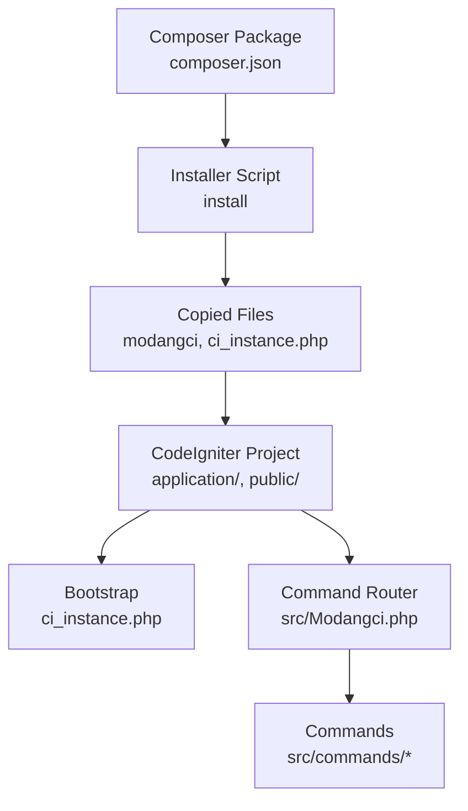
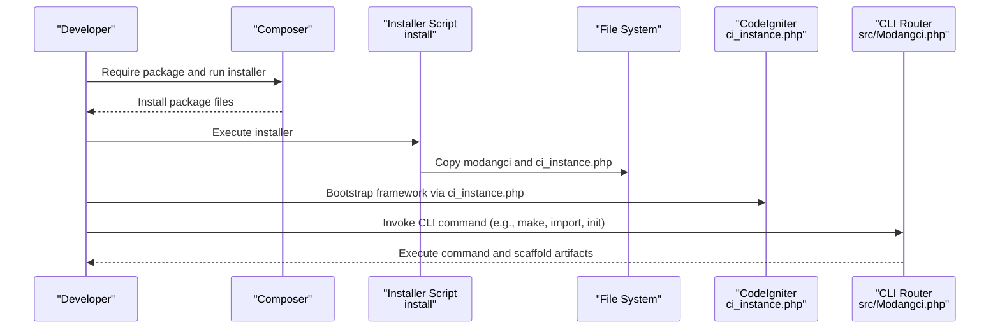
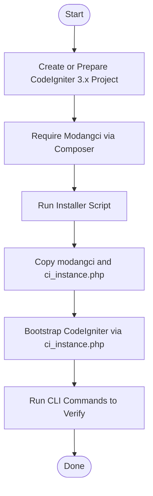
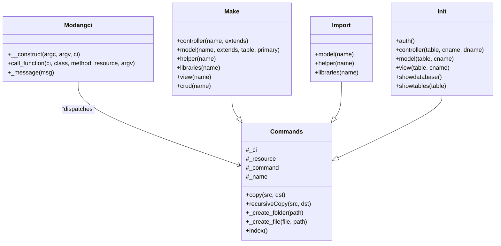
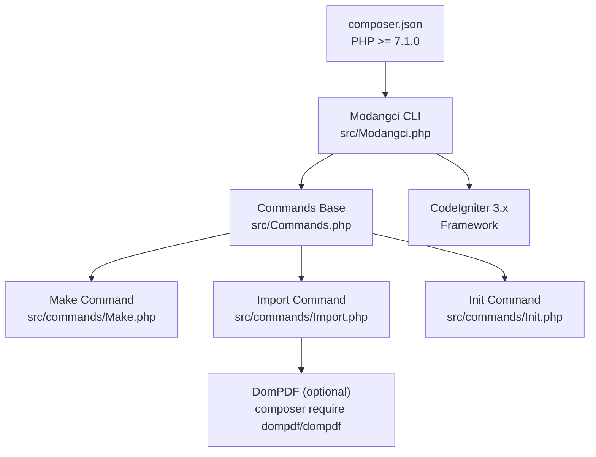

# Installation and Setup

<cite>
**Referenced Files in This Document**
- [composer.json](file://composer.json)
- [README.md](file://README.md)
- [install](file://install)
- [ci_instance.php](file://ci_instance.php)
- [src/Modangci.php](file://src/Modangci.php)
- [src/Commands.php](file://src/Commands.php)
- [src/commands/Make.php](file://src/commands/Make.php)
- [src/commands/Import.php](file://src/commands/Import.php)
- [src/commands/Init.php](file://src/commands/Init.php)
- [src/application/core/MY_Controller.php](file://src/application/core/MY_Controller.php)
- [src/application/core/MY_Model.php](file://src/application/core/MY_Model.php)
- [src/application/libraries/Encryptions.php](file://src/application/libraries/Encryptions.php)
</cite>

## Table of Contents
1. [Introduction](#introduction)
2. [Project Structure](#project-structure)
3. [Core Components](#core-components)
4. [Architecture Overview](#architecture-overview)
5. [Detailed Component Analysis](#detailed-component-analysis)
6. [Dependency Analysis](#dependency-analysis)
7. [Performance Considerations](#performance-considerations)
8. [Troubleshooting Guide](#troubleshooting-guide)
9. [Conclusion](#conclusion)

## Introduction
This section documents the complete installation and setup process for integrating Modangci into an existing CodeIgniter 3.x project. It covers prerequisites, Composer integration, environment preparation, step-by-step installation commands, post-installation verification, and compatibility requirements. It also explains how Modangci integrates with CodeIgniter via ci_instance.php and how to validate configurations after installation.

## Project Structure
Modangci is distributed as a Composer package and provides:
- A CLI installer script to copy necessary files into an existing CodeIgniter project
- A bootstrap file (ci_instance.php) to initialize the CodeIgniter framework outside of HTTP requests
- A command router (src/Modangci.php) that dispatches CLI commands to subcommands
- Command implementations under src/commands/* for scaffolding, importing, and generating artifacts
- Example CodeIgniter 3.x application assets and controllers included for demonstration

**Diagram sources**
- [composer.json:1-25](file://composer.json#L1-L25)
- [install:1-60](file://install#L1-L60)
- [ci_instance.php:1-87](file://ci_instance.php#L1-L87)
- [src/Modangci.php:1-60](file://src/Modangci.php#L1-L60)

**Section sources**
- [composer.json:1-25](file://composer.json#L1-L25)
- [README.md:7-14](file://README.md#L7-L14)
- [install:1-60](file://install#L1-L60)

## Core Components
- Prerequisites
  - PHP >= 7.1.0 (enforced by composer.json)
  - Existing CodeIgniter 3.x project with the standard directory layout (application, system, public)
- Composer integration
  - Add the package to your project and run the installer
- Environment preparation
  - Ensure the CodeIgniter framework is installed and autoloadable
  - Confirm database connectivity if using Init commands that scaffold authentication and CRUD
- Post-installation verification
  - Run CLI commands to confirm routing and scaffolding capabilities
  - Verify copied files and framework bootstrap

**Section sources**
- [composer.json:17-19](file://composer.json#L17-L19)
- [README.md:7-14](file://README.md#L7-L14)
- [install:22-26](file://install#L22-L26)
- [ci_instance.php:15-32](file://ci_instance.php#L15-L32)

## Architecture Overview
The installation and setup pipeline connects Composer, the installer, and the CodeIgniter framework bootstrap to enable CLI-driven scaffolding and generation.

**Diagram sources**
- [install:11-26](file://install#L11-L26)
- [ci_instance.php:79-86](file://ci_instance.php#L79-L86)
- [src/Modangci.php:10-41](file://src/Modangci.php#L10-L41)

## Detailed Component Analysis

### Installation Steps
Follow these steps to install and set up Modangci in a CodeIgniter 3.x project:

1. Create or prepare a CodeIgniter 3.x project
   - Use the official installer or an existing project with the standard layout
2. Require the package via Composer
   - Add the package to your project dependencies
3. Run the installer
   - Execute the installer script to copy necessary files into your project
4. Bootstrap the framework for CLI
   - Use ci_instance.php to initialize CodeIgniter for command-line operations
5. Verify installation
   - Run CLI commands to confirm scaffolding and generation work

**Diagram sources**
- [README.md:8-13](file://README.md#L8-L13)
- [install:11-26](file://install#L11-L26)
- [ci_instance.php:79-86](file://ci_instance.php#L79-L86)

**Section sources**
- [README.md:7-14](file://README.md#L7-L14)
- [install:11-26](file://install#L11-L26)

### Composer Integration
- Package metadata and autoloading
  - The package defines PSR-4 autoloading for Modangci namespace
- Version constraints
  - Requires PHP >= 7.1.0
- Installation command
  - Add the package to your project and run the installer

**Section sources**
- [composer.json:20-24](file://composer.json#L20-L24)
- [composer.json:17-19](file://composer.json#L17-L19)
- [README.md:11-13](file://README.md#L11-L13)

### Environment Preparation
- Directory layout expectations
  - The installer expects standard CodeIgniter paths (application, system, public)
- Framework bootstrap
  - ci_instance.php sets BASEPATH, APPPATH, VIEWPATH, and loads core classes
- Session storage
  - Init scaffolding creates a sessions directory for session persistence

**Section sources**
- [install:22-23](file://install#L22-L23)
- [ci_instance.php:15-32](file://ci_instance.php#L15-L32)
- [src/commands/Init.php:422-424](file://src/commands/Init.php#L422-L424)

### Post-Installation Verification
- Confirm CLI routing
  - The CLI router validates that the request originates from CLI and dispatches commands
- Validate command availability
  - Use the index command to list available commands and options
- Test scaffolding
  - Run a simple command (e.g., make controller) to ensure files are generated

**Section sources**
- [src/Modangci.php:12-17](file://src/Modangci.php#L12-L17)
- [src/Modangci.php:39-40](file://src/Modangci.php#L39-L40)
- [src/Commands.php:99-133](file://src/Commands.php#L99-L133)

### Integration with Existing CodeIgniter Projects
- Bootstrapping outside HTTP
  - ci_instance.php initializes the framework and returns a CI_Controller instance for CLI usage
- Namespace and autoloading
  - PSR-4 autoloading maps Modangci namespace to src/
- Command routing
  - src/Modangci.php routes CLI arguments to specific command classes

**Diagram sources**
- [src/Modangci.php:7-59](file://src/Modangci.php#L7-L59)
- [src/Commands.php:7-134](file://src/Commands.php#L7-L134)
- [src/commands/Make.php:7-210](file://src/commands/Make.php#L7-L210)
- [src/commands/Import.php:7-52](file://src/commands/Import.php#L7-L52)
- [src/commands/Init.php:7-478](file://src/commands/Init.php#L7-L478)

**Section sources**
- [ci_instance.php:79-86](file://ci_instance.php#L79-L86)
- [src/Modangci.php:10-41](file://src/Modangci.php#L10-L41)

### Practical Examples of Successful Installation Scenarios
- Scenario 1: Fresh CodeIgniter project with Modangci
  - Steps: create project -> require package -> run installer -> bootstrap -> run a command
  - Expected outcome: files copied, CLI command executed successfully
- Scenario 2: Existing project with Composer managed dependencies
  - Steps: require package -> run installer -> bootstrap -> verify commands
  - Expected outcome: existing project structure preserved, new files integrated

**Section sources**
- [README.md:8-13](file://README.md#L8-L13)
- [install:22-26](file://install#L22-L26)

### Configuration Validation Steps
- Validate framework bootstrap
  - Confirm ci_instance.php initializes BASEPATH, APPPATH, and loads core classes
- Validate autoload configuration
  - Ensure the project’s autoloader recognizes Modangci classes
- Validate database configuration (for Init commands)
  - Confirm database credentials and connectivity for authentication scaffolding
- Validate session configuration
  - Ensure sessions directory exists and is writable

**Section sources**
- [ci_instance.php:15-32](file://ci_instance.php#L15-L32)
- [src/commands/Init.php:471-477](file://src/commands/Init.php#L471-L477)
- [src/commands/Init.php:422-424](file://src/commands/Init.php#L422-L424)

## Dependency Analysis
- Internal dependencies
  - Modangci CLI router depends on command classes under src/commands/*
  - Commands rely on CodeIgniter’s file helper for writing files
- External dependencies
  - PHP >= 7.1.0 enforced by composer.json
  - CodeIgniter 3.x framework required for runtime operations
  - Optional: DomPDF for PDF generation (import libraries pdfgenerator)

**Diagram sources**
- [composer.json:17-19](file://composer.json#L17-L19)
- [src/Modangci.php:5](file://src/Modangci.php#L5)
- [src/Commands.php:14](file://src/Commands.php#L14)
- [src/commands/Import.php:39-46](file://src/commands/Import.php#L39-L46)

**Section sources**
- [composer.json:17-19](file://composer.json#L17-L19)
- [src/commands/Import.php:39-46](file://src/commands/Import.php#L39-L46)

## Performance Considerations
- Minimize repeated filesystem writes by running commands selectively
- Use Init scaffolding to avoid manual repetitive setup tasks
- Keep Composer dependencies updated to benefit from performance improvements

## Troubleshooting Guide
- PHP version mismatch
  - Ensure PHP >= 7.1.0; otherwise Composer will fail during installation
- Composer autoload not recognizing Modangci
  - Regenerate autoload files after requiring the package
- Installer fails to copy files
  - Verify write permissions in the project root and that ci_instance.php and modangci are copied
- CLI command not recognized
  - Confirm the CLI router validates CLI requests and that commands are properly dispatched
- Init auth scaffolding errors
  - Verify database connectivity and that the information_schema database is accessible
- Encryption library dependency
  - Ensure encryption library is initialized before using Encryptions class

**Section sources**
- [composer.json:17-19](file://composer.json#L17-L19)
- [install:27-33](file://install#L27-L33)
- [src/Modangci.php:12-17](file://src/Modangci.php#L12-L17)
- [src/commands/Init.php:13-28](file://src/commands/Init.php#L13-L28)
- [src/application/libraries/Encryptions.php:21-35](file://src/application/libraries/Encryptions.php#L21-L35)

## Conclusion
By following the documented installation and setup procedure, integrating Modangci into a CodeIgniter 3.x project is straightforward. Composer handles dependency management, the installer copies essential files, and ci_instance.php enables seamless framework bootstrapping for CLI operations. Use the provided verification steps and troubleshooting tips to ensure a smooth setup and operation of Modangci commands.