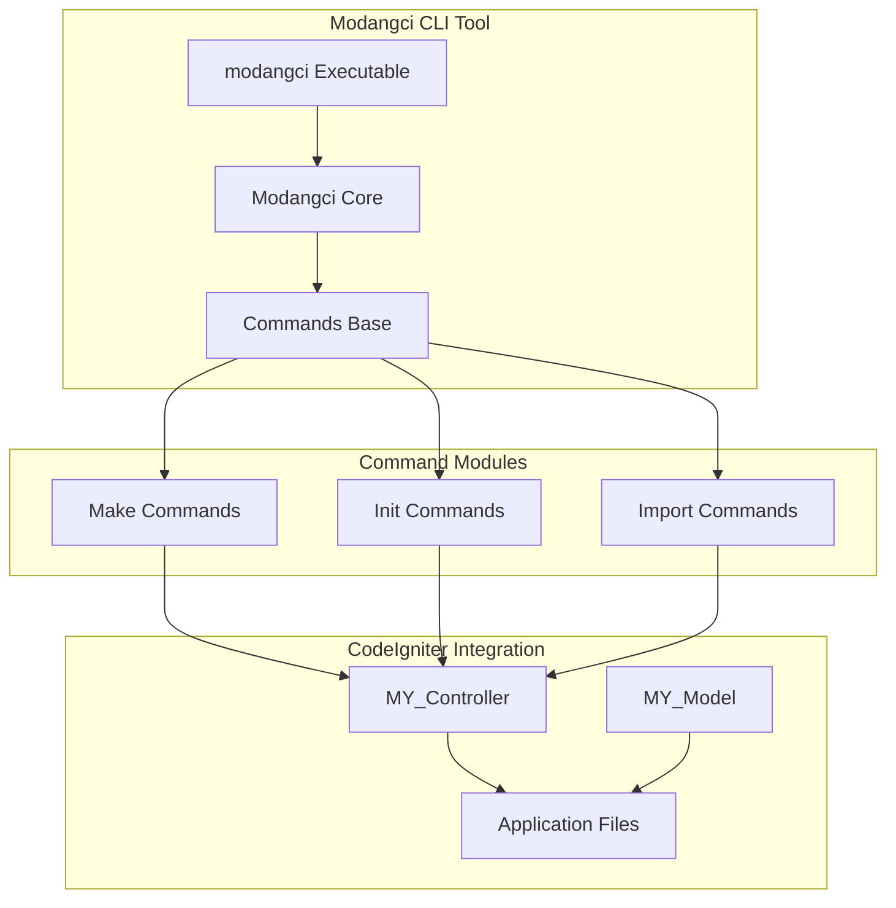
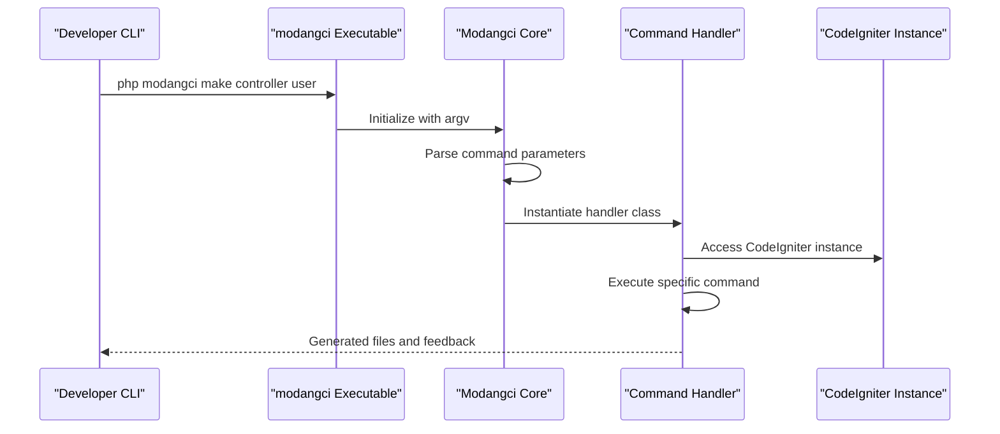
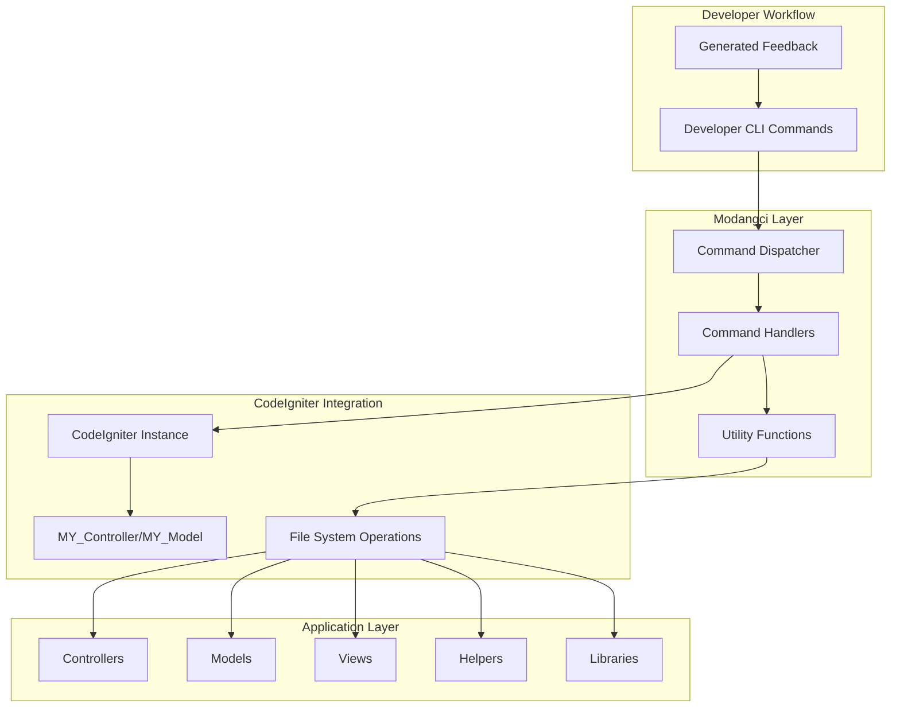
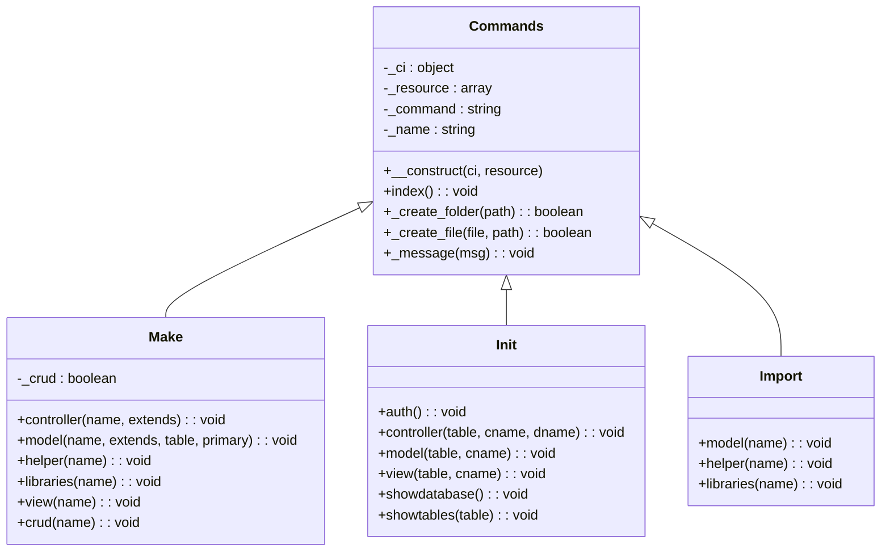
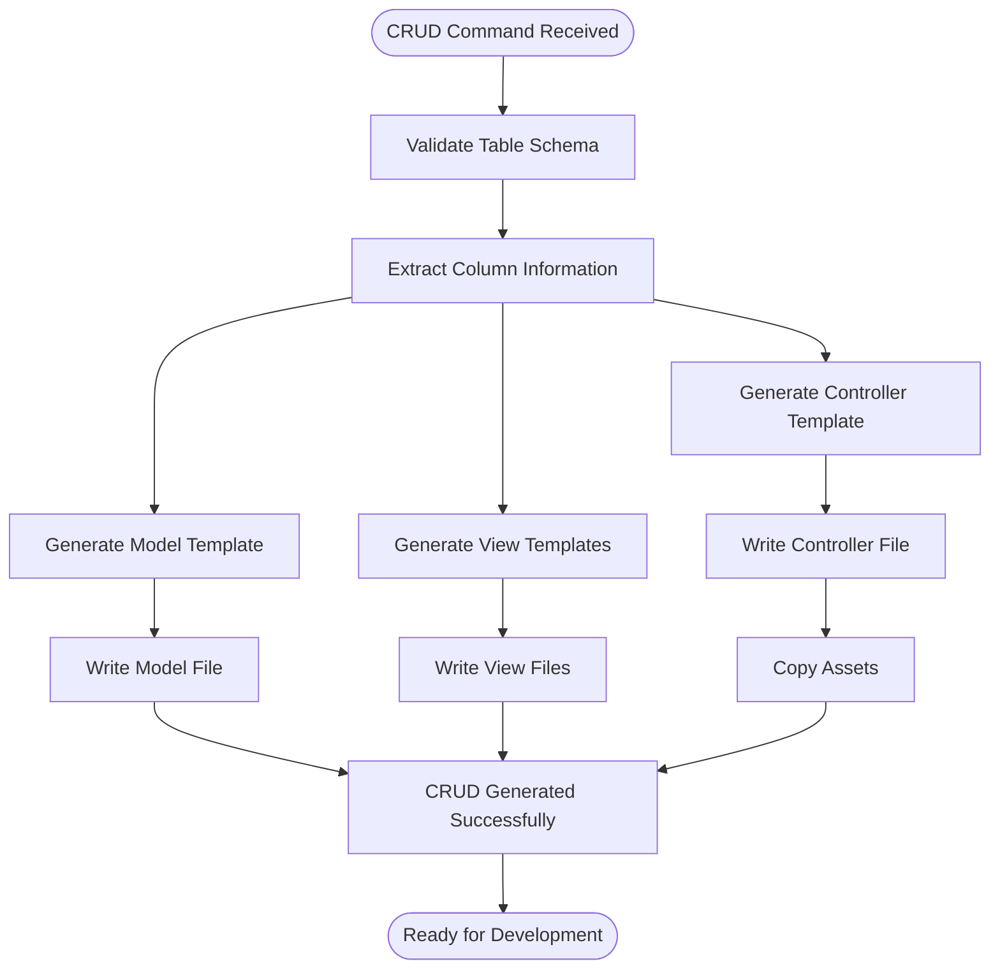
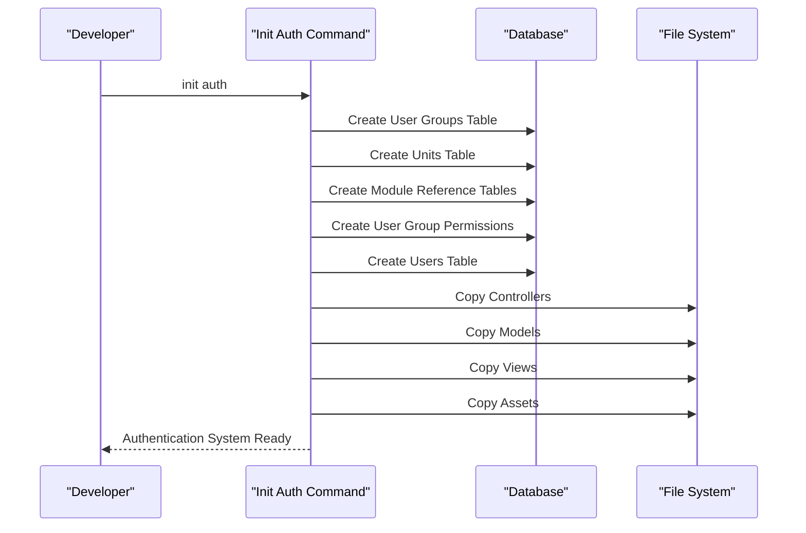
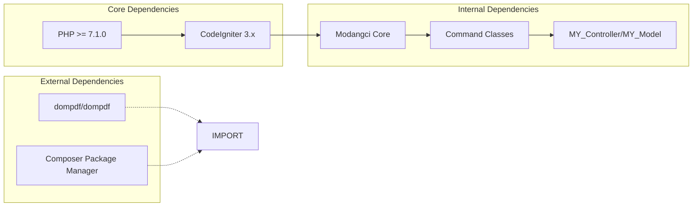

# Introduction and Purpose

<cite>
**Referenced Files in This Document**
- [README.md](file://README.md)
- [composer.json](file://composer.json)
- [modangci](file://modangci)
- [install](file://install)
- [src/Modangci.php](file://src/Modangci.php)
- [src/Commands.php](file://src/Commands.php)
- [src/commands/Make.php](file://src/commands/Make.php)
- [src/commands/Init.php](file://src/commands/Init.php)
- [src/commands/Import.php](file://src/commands/Import.php)
- [src/application/core/MY_Controller.php](file://src/application/core/MY_Controller.php)
- [src/application/core/MY_Model.php](file://src/application/core/MY_Model.php)
</cite>

## Table of Contents
1. [Introduction](#introduction)
2. [Project Structure](#project-structure)
3. [Core Components](#core-components)
4. [Architecture Overview](#architecture-overview)
5. [Detailed Component Analysis](#detailed-component-analysis)
6. [Dependency Analysis](#dependency-analysis)
7. [Performance Considerations](#performance-considerations)
8. [Troubleshooting Guide](#troubleshooting-guide)
9. [Conclusion](#conclusion)

## Introduction

Modangci is a command-line tool designed specifically for CodeIgniter 3 development that automates repetitive CRUD scaffolding and CLI development tasks. As an automated CRUD generator and CLI development assistant, Modangci streamlines the traditional CodeIgniter development workflow by eliminating manual boilerplate code creation and providing standardized scaffolding patterns.

### What Modangci Solves

Traditional CodeIgniter development involves significant repetitive tasks that slow down development velocity and increase maintenance overhead:

- **Manual CRUD Generation**: Developers spend considerable time writing identical controller, model, and view code for each entity
- **Boilerplate Code Creation**: Every new feature requires creating controllers, models, views, and associated helper files
- **Scaffolding Inconsistencies**: Without automation, teams often implement inconsistent patterns across applications
- **Database Schema Integration**: Manual mapping between database tables and application components introduces errors
- **Authentication Setup**: Complex multi-role authentication systems require extensive manual configuration

### Target Audience

Modangci serves multiple developer skill levels within the CodeIgniter ecosystem:

- **Beginner CodeIgniter Developers**: Learning the MVC pattern and CRUD operations through automated scaffolding
- **Intermediate Developers**: Accelerating development speed while maintaining consistent application structure
- **Team Leads and Senior Developers**: Standardizing development practices and reducing onboarding time for new team members
- **Development Teams**: Improving collaboration through consistent code generation patterns

### Why Automated Scaffolding Improves Efficiency

Automated scaffolding fundamentally transforms the development process by:

- **Reducing Development Time**: Eliminating 70-80% of repetitive code creation tasks
- **Improving Code Quality**: Enforcing consistent patterns and best practices across all generated code
- **Enhancing Maintainability**: Providing standardized structure that makes applications easier to navigate and modify
- **Accelerating Onboarding**: New team members can immediately contribute using established patterns
- **Minimizing Errors**: Automated generation reduces human error in boilerplate code creation

## Project Structure

Modangci follows a modular architecture organized around three primary command categories:

**Diagram sources**
- [modangci:1-26](file://modangci#L1-L26)
- [src/Modangci.php:1-60](file://src/Modangci.php#L1-L60)
- [src/Commands.php:1-135](file://src/Commands.php#L1-L135)

**Section sources**
- [README.md:1-41](file://README.md#L1-L41)
- [composer.json:1-25](file://composer.json#L1-L25)

## Core Components

### Command Dispatch System

Modangci implements a centralized command dispatch mechanism that routes CLI arguments to specific command handlers:

**Diagram sources**
- [modangci:1-26](file://modangci#L1-L26)
- [src/Modangci.php:10-41](file://src/Modangci.php#L10-L41)

### Command Categories

Modangci organizes functionality into three distinct command categories:

1. **Make Commands**: Generate individual components (controllers, models, helpers, libraries, views)
2. **Init Commands**: Create complete application scaffolding from database schemas
3. **Import Commands**: Add pre-built components to existing applications

**Section sources**
- [src/Modangci.php:1-60](file://src/Modangci.php#L1-L60)
- [src/Commands.php:1-135](file://src/Commands.php#L1-L135)

## Architecture Overview

Modangci integrates seamlessly with CodeIgniter 3 through a carefully designed architecture that maintains framework compatibility while providing powerful automation capabilities:

**Diagram sources**
- [src/Modangci.php:1-60](file://src/Modangci.php#L1-L60)
- [src/commands/Make.php:1-211](file://src/commands/Make.php#L1-L211)
- [src/application/core/MY_Controller.php:1-59](file://src/application/core/MY_Controller.php#L1-L59)

## Detailed Component Analysis

### Make Command System

The Make command system provides granular control over individual component generation:

**Diagram sources**
- [src/Commands.php:7-135](file://src/Commands.php#L7-L135)
- [src/commands/Make.php:7-211](file://src/commands/Make.php#L7-L211)
- [src/commands/Init.php:7-917](file://src/commands/Init.php#L7-L917)
- [src/commands/Import.php:7-53](file://src/commands/Import.php#L7-L53)

### CRUD Generation Workflow

The CRUD generation process demonstrates Modangci's comprehensive automation capabilities:

**Diagram sources**
- [src/commands/Make.php:196-210](file://src/commands/Make.php#L196-L210)
- [src/commands/Init.php:480-640](file://src/commands/Init.php#L480-L640)

### Authentication Scaffolding

Modangci provides comprehensive authentication scaffolding for multi-role applications:

**Diagram sources**
- [src/commands/Init.php:125-478](file://src/commands/Init.php#L125-L478)

**Section sources**
- [src/commands/Make.php:1-211](file://src/commands/Make.php#L1-L211)
- [src/commands/Init.php:1-917](file://src/commands/Init.php#L1-L917)
- [src/commands/Import.php:1-53](file://src/commands/Import.php#L1-L53)

## Dependency Analysis

Modangci maintains minimal external dependencies while providing comprehensive functionality:

**Diagram sources**
- [composer.json:17-24](file://composer.json#L17-L24)
- [src/commands/Import.php:37-51](file://src/commands/Import.php#L37-L51)

**Section sources**
- [composer.json:1-25](file://composer.json#L1-L25)

## Performance Considerations

Modangci is designed for optimal performance in development environments:

- **Minimal Runtime Overhead**: Command execution completes within milliseconds
- **Efficient File Operations**: Uses optimized file copying and writing mechanisms
- **Database Schema Caching**: Leverages CodeIgniter's database abstraction layer efficiently
- **Memory Management**: Cleans up resources after command completion
- **Parallel Processing**: Multiple file operations occur concurrently where possible

## Troubleshooting Guide

Common issues and solutions when using Modangci:

### Installation Issues
- **Composer Dependency Errors**: Ensure PHP version meets minimum requirements
- **Autoloader Problems**: Run `composer dump-autoload` after installation
- **Permission Issues**: Verify write permissions for application directories

### Command Execution Problems
- **CLI Environment Detection**: Modangci only runs in CLI mode
- **Parameter Validation**: Check command syntax against documented formats
- **File Permission Errors**: Verify application folders are writable

### Database Integration Issues
- **Connection Problems**: Verify database configuration matches CodeIgniter settings
- **Schema Access**: Ensure database user has sufficient privileges for INFORMATION_SCHEMA
- **Table Existence**: Confirm target tables exist before running Init commands

**Section sources**
- [src/Modangci.php:13-17](file://src/Modangci.php#L13-L17)
- [src/commands/Init.php:13-29](file://src/commands/Init.php#L13-L29)

## Conclusion

Modangci represents a significant advancement in CodeIgniter 3 development efficiency by providing comprehensive automation for CRUD generation, authentication scaffolding, and component import. Its architecture ensures seamless integration with existing CodeIgniter applications while dramatically reducing development time and improving code quality.

By automating repetitive tasks and enforcing consistent patterns, Modangci enables developers to focus on business logic rather than boilerplate code, ultimately resulting in more maintainable and scalable applications. The tool's comprehensive command system and robust error handling make it suitable for developers of all skill levels, from beginners learning CodeIgniter fundamentals to experienced team leads managing complex development workflows.