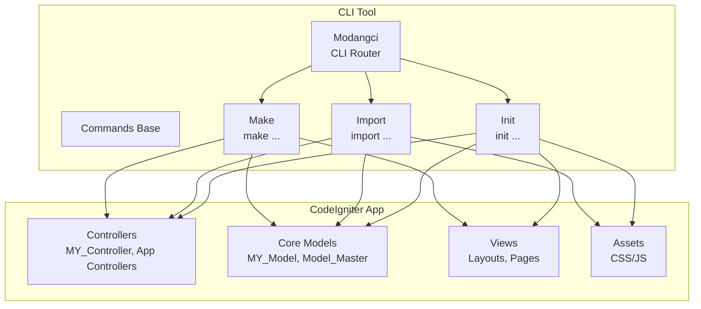
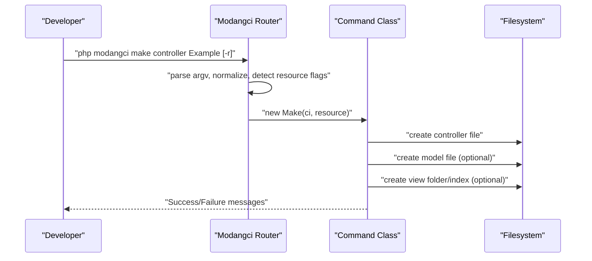
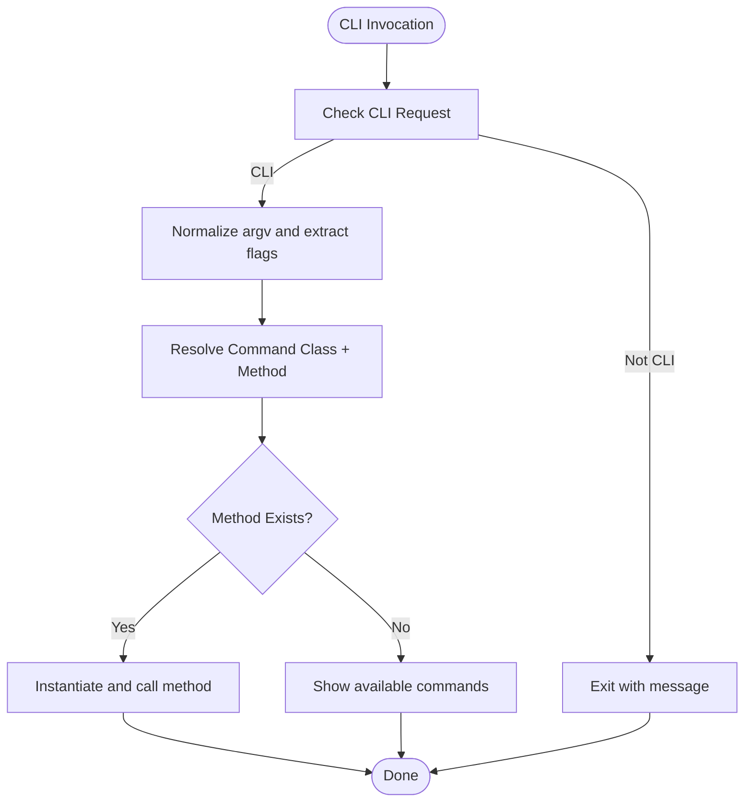
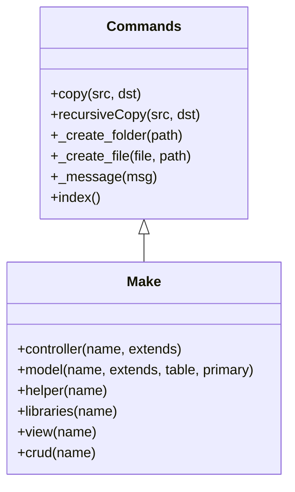
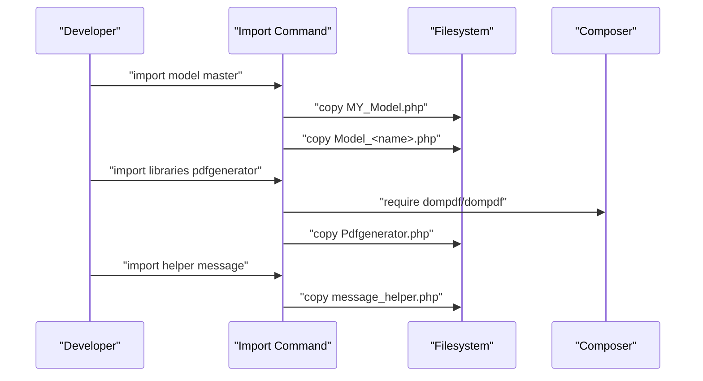
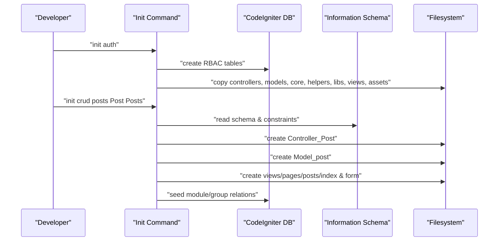
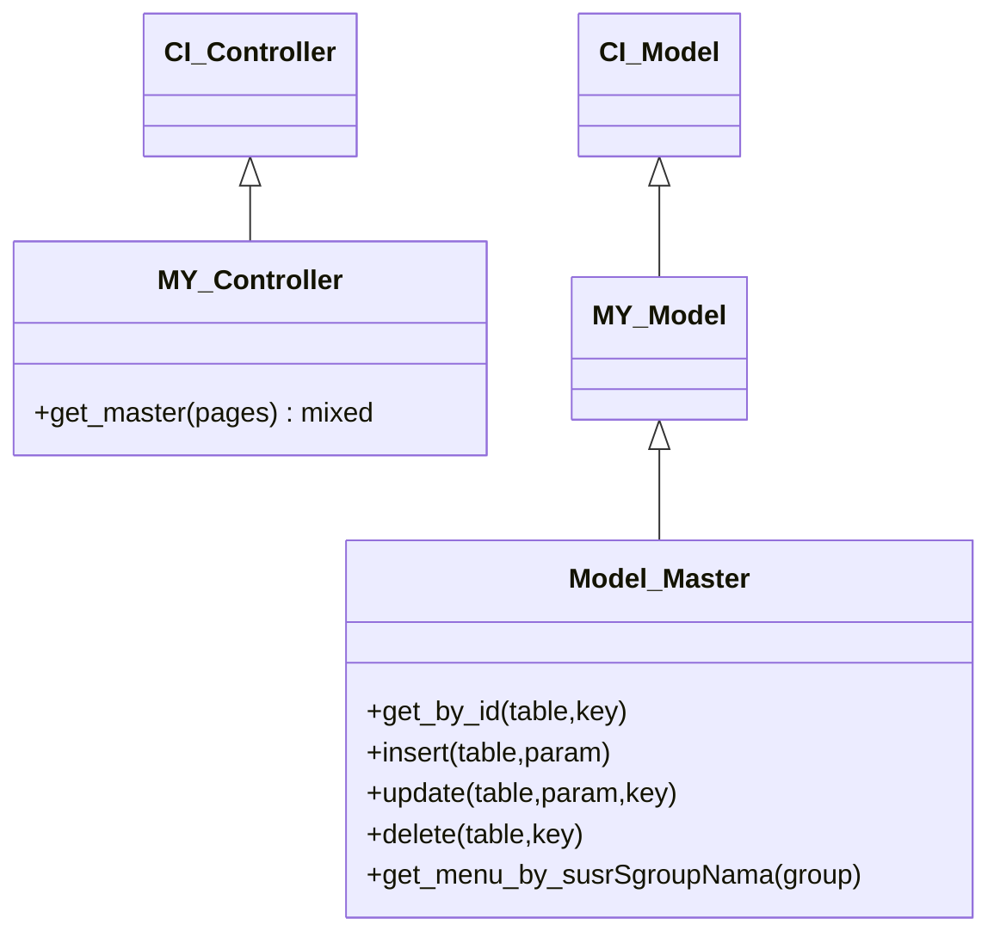
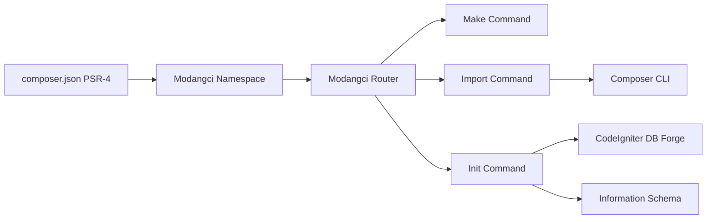

# Project Overview

<cite>
**Referenced Files in This Document**
- [README.md](file://README.md)
- [composer.json](file://composer.json)
- [src/Modangci.php](file://src/Modangci.php)
- [src/Commands.php](file://src/Commands.php)
- [src/commands/Make.php](file://src/commands/Make.php)
- [src/commands/Import.php](file://src/commands/Import.php)
- [src/commands/Init.php](file://src/commands/Init.php)
- [src/application/core/MY_Controller.php](file://src/application/core/MY_Controller.php)
- [src/application/core/MY_Model.php](file://src/application/core/MY_Model.php)
- [src/application/core/Model_Master.php](file://src/application/core/Model_Master.php)
- [src/application/controllers/Home.php](file://src/application/controllers/Home.php)
- [src/application/models/Model_home.php](file://src/application/models/Model_home.php)
- [install](file://install)
</cite>

## Table of Contents
1. [Introduction](#introduction)
2. [Project Structure](#project-structure)
3. [Core Components](#core-components)
4. [Architecture Overview](#architecture-overview)
5. [Detailed Component Analysis](#detailed-component-analysis)
6. [Dependency Analysis](#dependency-analysis)
7. [Performance Considerations](#performance-considerations)
8. [Troubleshooting Guide](#troubleshooting-guide)
9. [Conclusion](#conclusion)

## Introduction
Modangci is a CodeIgniter 3 CRUD generator and CLI development tool designed to accelerate scaffolding of typical web applications built with CodeIgniter. It provides:
- Automated generation of controllers, models, helpers, libraries, and views
- Full CRUD scaffolding for database-backed resources
- Authentication scaffolding with role-based access control (RBAC) tables and controllers
- Seamless integration with CodeIgniter’s ecosystem (MY_Controller, MY_Model, Model_Master, and core helpers/libraries)

The tool targets both beginners who want rapid prototyping and experienced developers who need repeatable, consistent boilerplate aligned with CodeIgniter conventions.

## Project Structure
At a high level, Modangci consists of:
- A CLI entrypoint that routes commands to command classes
- Command classes for Make, Import, and Init operations
- CodeIgniter application assets (controllers, models, core classes, views, and libraries) packaged for import or scaffolding
- An installer script to place the CLI binary and a CodeIgniter instance bridge into your project

**Diagram sources**
- [src/Modangci.php:10-41](file://src/Modangci.php#L10-L41)
- [src/Commands.php:14-134](file://src/Commands.php#L14-L134)
- [src/commands/Make.php:16-211](file://src/commands/Make.php#L16-L211)
- [src/commands/Import.php:14-53](file://src/commands/Import.php#L14-L53)
- [src/commands/Init.php:125-478](file://src/commands/Init.php#L125-L478)

**Section sources**
- [README.md:15-41](file://README.md#L15-L41)
- [composer.json:20-25](file://composer.json#L20-L25)
- [src/Modangci.php:10-41](file://src/Modangci.php#L10-L41)
- [src/Commands.php:14-134](file://src/Commands.php#L14-L134)

## Core Components
- CLI Router (Modangci): Parses argv, validates CLI context, normalizes arguments, and dispatches to the appropriate command class and method.
- Commands Base (Commands): Shared utilities for copying files/folders, creating directories and files, and printing messages.
- Make: Generates individual components (controller, model, helper, libraries, view) and a full CRUD bundle (-r resource flag).
- Import: Copies prebuilt core classes, helpers, and libraries into your application.
- Init: Creates RBAC scaffolding (authentication, roles, permissions) and generates controllers, models, and views for a given table.

These components collectively enable automated scaffolding aligned with CodeIgniter’s conventions and the project’s internal core classes.

**Section sources**
- [src/Modangci.php:10-59](file://src/Modangci.php#L10-L59)
- [src/Commands.php:14-134](file://src/Commands.php#L14-L134)
- [src/commands/Make.php:16-211](file://src/commands/Make.php#L16-L211)
- [src/commands/Import.php:14-53](file://src/commands/Import.php#L14-L53)
- [src/commands/Init.php:125-478](file://src/commands/Init.php#L125-L478)

## Architecture Overview
The CLI architecture follows a simple dispatcher pattern:
- The router reads command arguments and constructs a fully qualified class name (e.g., Modangci\Commands\Make).
- It instantiates the command class and invokes the requested method with remaining arguments.
- Command classes use shared helpers to create files and folders under APPPATH and optionally copy assets from the package.

**Diagram sources**
- [src/Modangci.php:10-41](file://src/Modangci.php#L10-L41)
- [src/commands/Make.php:16-73](file://src/commands/Make.php#L16-L73)

**Section sources**
- [src/Modangci.php:10-41](file://src/Modangci.php#L10-L41)
- [src/commands/Make.php:16-73](file://src/commands/Make.php#L16-L73)

## Detailed Component Analysis

### CLI Router and Command Dispatch
- Validates CLI context and rejects non-CLI invocations.
- Normalizes arguments and extracts resource flags (-r/--resource).
- Resolves command class and method names, then calls the method with remaining arguments.
- Falls back to listing available commands if the method does not exist.

**Diagram sources**
- [src/Modangci.php:13-53](file://src/Modangci.php#L13-L53)

**Section sources**
- [src/Modangci.php:13-53](file://src/Modangci.php#L13-L53)

### Make: Component and CRUD Generation
- Controller: Creates a controller extending CI_Controller or a provided base class. With -r, it adds response/create/update/save/delete stubs and loads a model if configured.
- Model: Creates a model extending CI_Model or a provided base class. Optionally defines table and primary key variables and generates all()/by_id() convenience functions.
- Helper: Creates a standard CodeIgniter helper file with a namespaced function declaration.
- Libraries: Creates a library class with optional access to CodeIgniter instance via get_instance().
- View: Creates a minimal HTML page or a placeholder for CRUD data.
- CRUD: Orchestrates controller, model, and view generation for a named resource.

**Diagram sources**
- [src/Commands.php:20-97](file://src/Commands.php#L20-L97)
- [src/commands/Make.php:16-211](file://src/commands/Make.php#L16-L211)

**Section sources**
- [src/commands/Make.php:16-211](file://src/commands/Make.php#L16-L211)

### Import: Asset and Core Class Provisioning
- Copies MY_Model and a specific Model_... into application/core/.
- Copies helper files into application/helpers/.
- Copies libraries into application/libraries/. For certain libraries, it can trigger Composer to install dependencies (e.g., PDF generator).
- Provides a consistent way to bring reusable components into your application.

**Diagram sources**
- [src/commands/Import.php:14-53](file://src/commands/Import.php#L14-L53)

**Section sources**
- [src/commands/Import.php:14-53](file://src/commands/Import.php#L14-L53)

### Init: Authentication and CRUD Scaffolding
- Authentication scaffolding:
  - Creates RBAC tables (user groups, units, modules, group-module relations, group-unit relations, users).
  - Seeds default records and foreign keys.
  - Copies controllers, models, core classes, helpers, libraries, views, and assets into your application.
  - Prints autoload and config hints for session storage and helpers/libraries.
- CRUD scaffolding for a table:
  - Reads schema and constraints from information_schema.
  - Generates a controller extending MY_Controller with index/create/update/save/delete actions, form validation, encryption for keys, and AJAX-friendly save flow.
  - Generates a model extending Model_Master with all()/by_id() and joins for foreign keys.
  - Generates views for index and form, including dynamic table headers, rows, and form controls based on schema.

**Diagram sources**
- [src/commands/Init.php:125-478](file://src/commands/Init.php#L125-L478)
- [src/commands/Init.php:480-640](file://src/commands/Init.php#L480-L640)
- [src/commands/Init.php:642-701](file://src/commands/Init.php#L642-L701)
- [src/commands/Init.php:703-892](file://src/commands/Init.php#L703-L892)
- [src/commands/Init.php:894-917](file://src/commands/Init.php#L894-L917)

**Section sources**
- [src/commands/Init.php:125-478](file://src/commands/Init.php#L125-L478)
- [src/commands/Init.php:480-640](file://src/commands/Init.php#L480-L640)
- [src/commands/Init.php:642-701](file://src/commands/Init.php#L642-L701)
- [src/commands/Init.php:703-892](file://src/commands/Init.php#L703-L892)
- [src/commands/Init.php:894-917](file://src/commands/Init.php#L894-L917)

### CodeIgniter Integration and Core Classes
- MY_Controller: Base controller that enforces login checks and provides a get_master() method to assemble templates, menus, breadcrumbs, and page-specific data.
- MY_Model: Minimal base model that delegates to Model_Master.
- Model_Master: Centralized database operations (CRUD with transactions), reference table retrieval, menu queries, and permission checks used by controllers.

**Diagram sources**
- [src/application/core/MY_Controller.php:3-59](file://src/application/core/MY_Controller.php#L3-L59)
- [src/application/core/MY_Model.php:3-21](file://src/application/core/MY_Model.php#L3-L21)
- [src/application/core/Model_Master.php:2-257](file://src/application/core/Model_Master.php#L2-L257)

**Section sources**
- [src/application/core/MY_Controller.php:3-59](file://src/application/core/MY_Controller.php#L3-L59)
- [src/application/core/MY_Model.php:3-21](file://src/application/core/MY_Model.php#L3-L21)
- [src/application/core/Model_Master.php:2-257](file://src/application/core/Model_Master.php#L2-L257)

### Practical Workflows and Examples
- Install and initialize:
  - Create a CodeIgniter project, require the package, run the installer, then run initial commands.
- Generate a simple CRUD:
  - Use make crud to scaffold controller, model, and views for a named resource.
- Import reusable components:
  - Bring in MY_Model, helpers, or libraries with import commands.
- Scaffold authentication and RBAC:
  - Run init auth to set up tables, seed data, and copy controllers/models/views/assets. Then generate CRUD for your domain tables.

These workflows align with CodeIgniter conventions and leverage the project’s core classes for consistent behavior.

**Section sources**
- [README.md:7-41](file://README.md#L7-L41)
- [install:15-26](file://install#L15-L26)

## Dependency Analysis
- Package metadata declares PSR-4 autoloading for Modangci namespace under src/.
- The CLI relies on CodeIgniter’s input helper for CLI detection and filesystem helpers for writing files.
- Init uses CodeIgniter’s database forge and information_schema to introspect tables and constraints.
- Some libraries require Composer-managed dependencies (e.g., PDF generator).

**Diagram sources**
- [composer.json:20-25](file://composer.json#L20-L25)
- [src/Modangci.php:12-17](file://src/Modangci.php#L12-L17)
- [src/commands/Init.php:13-29](file://src/commands/Init.php#L13-L29)
- [src/commands/Import.php:45-47](file://src/commands/Import.php#L45-L47)

**Section sources**
- [composer.json:20-25](file://composer.json#L20-L25)
- [src/Modangci.php:12-17](file://src/Modangci.php#L12-L17)
- [src/commands/Init.php:13-29](file://src/commands/Init.php#L13-L29)
- [src/commands/Import.php:45-47](file://src/commands/Import.php#L45-L47)

## Performance Considerations
- CRUD generation uses information_schema to infer schema and constraints; ensure your database connection is fast and accessible.
- Transactions are used for all CRUD operations in Model_Master; this ensures consistency but may impact throughput for bulk operations—consider batching inserts/updates where appropriate.
- Views generated by Init are dynamic and rely on helper functions; ensure helpers are autoloaded to avoid repeated loading overhead.

[No sources needed since this section provides general guidance]

## Troubleshooting Guide
- Non-CLI invocation: The router exits with a message if invoked outside CLI context.
- Invalid parameters: Arguments containing unsupported characters or flags are rejected; ensure only allowed flags like -r/--resource are used.
- File/folder creation failures: Creation routines check existence and permissions; ensure APPPATH is writable and paths are valid.
- Missing Composer dependencies: For libraries requiring Composer packages, run the import command again after installing dependencies.
- Database errors during Init: The command prints SQL errors; verify database credentials and permissions.

**Section sources**
- [src/Modangci.php:13-28](file://src/Modangci.php#L13-L28)
- [src/Commands.php:62-91](file://src/Commands.php#L62-L91)
- [src/commands/Import.php:45-47](file://src/commands/Import.php#L45-L47)
- [src/commands/Init.php:37-41](file://src/commands/Init.php#L37-L41)

## Conclusion
Modangci streamlines CodeIgniter 3 development by automating repetitive scaffolding tasks. It integrates tightly with CodeIgniter’s core classes and conventions, enabling rapid iteration on controllers, models, views, and authentication flows. Beginners benefit from quick-start scaffolding, while experienced developers gain a reliable, repeatable foundation for consistent application structure.