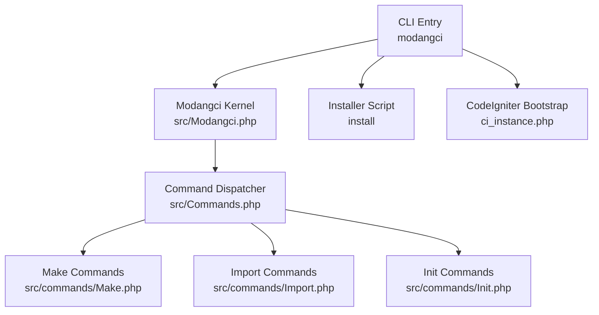
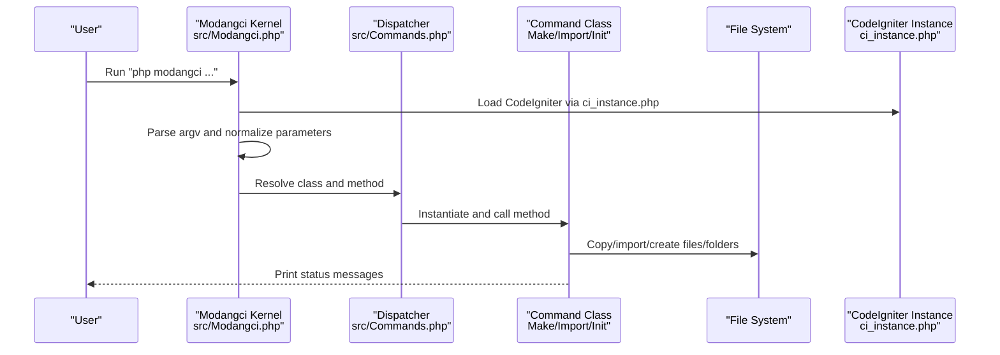
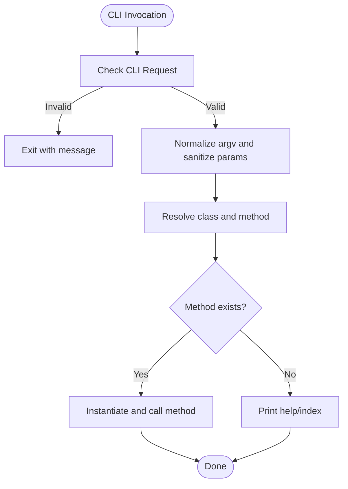
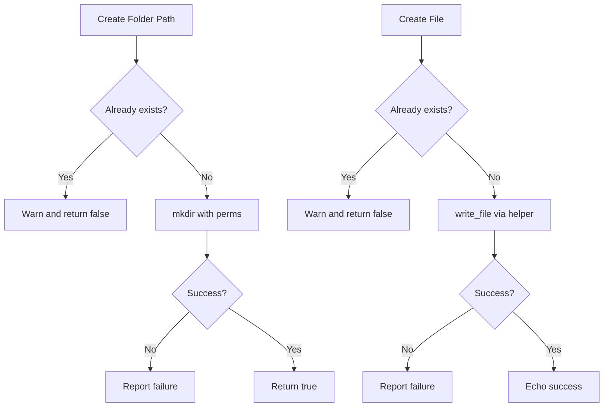
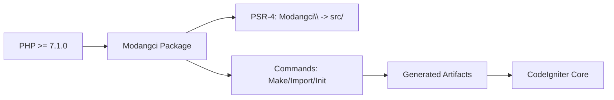

# Troubleshooting and FAQ

<cite>
**Referenced Files in This Document**
- [README.md](file://README.md)
- [composer.json](file://composer.json)
- [src/Modangci.php](file://src/Modangci.php)
- [src/Commands.php](file://src/Commands.php)
- [src/commands/Make.php](file://src/commands/Make.php)
- [src/commands/Import.php](file://src/commands/Import.php)
- [src/commands/Init.php](file://src/commands/Init.php)
- [install](file://install)
- [ci_instance.php](file://ci_instance.php)
- [src/application/helpers/debuglog_helper.php](file://src/application/helpers/debuglog_helper.php)
- [src/application/core/MY_Controller.php](file://src/application/core/MY_Controller.php)
- [src/application/core/MY_Model.php](file://src/application/core/MY_Model.php)
- [src/application/core/Model_Master.php](file://src/application/core/Model_Master.php)
</cite>

## Table of Contents
1. [Introduction](#introduction)
2. [Project Structure](#project-structure)
3. [Core Components](#core-components)
4. [Architecture Overview](#architecture-overview)
5. [Detailed Component Analysis](#detailed-component-analysis)
6. [Dependency Analysis](#dependency-analysis)
7. [Performance Considerations](#performance-considerations)
8. [Troubleshooting Guide](#troubleshooting-guide)
9. [Conclusion](#conclusion)
10. [Appendices](#appendices)

## Introduction
This document provides comprehensive troubleshooting and FAQ guidance for Modangci, a CodeIgniter 3 command-line tool. It focuses on resolving installation issues (Composer conflicts, PHP version mismatches, CodeIgniter integration), runtime problems (command failures, permissions, template generation), debugging techniques (command processing, error interpretation, log analysis), performance optimization, and integration/migration tips for existing CodeIgniter applications.

## Project Structure
Modangci is organized around a CLI entry point, a command dispatcher, and three command families:
- Commands dispatcher and base utilities
- Make: generate controllers, models, helpers, libraries, views, and CRUD scaffolds
- Import: bring in prebuilt models, helpers, and libraries into an existing CodeIgniter app
- Init: scaffold authentication and CRUD scaffolding from database schema

**Diagram sources**
- [src/Modangci.php:1-60](file://src/Modangci.php#L1-L60)
- [src/Commands.php:1-135](file://src/Commands.php#L1-L135)
- [src/commands/Make.php:1-211](file://src/commands/Make.php#L1-L211)
- [src/commands/Import.php:1-53](file://src/commands/Import.php#L1-L53)
- [src/commands/Init.php:1-917](file://src/commands/Init.php#L1-L917)
- [install:1-60](file://install#L1-L60)
- [ci_instance.php:1-87](file://ci_instance.php#L1-L87)

**Section sources**
- [README.md:1-41](file://README.md#L1-L41)
- [composer.json:1-25](file://composer.json#L1-L25)

## Core Components
- CLI Kernel: validates CLI context, parses arguments, and dispatches to the appropriate command class/method.
- Commands Base: shared utilities for copying files/folders, creating directories, writing files, and messaging.
- Make: generates boilerplate files and optional CRUD stacks.
- Import: copies selected components into an existing CodeIgniter application and optionally runs Composer installs for dependencies.
- Init: scaffolds authentication tables, controllers, models, views, and assets; integrates with database schema to generate CRUD.

**Section sources**
- [src/Modangci.php:10-53](file://src/Modangci.php#L10-L53)
- [src/Commands.php:14-97](file://src/Commands.php#L14-L97)
- [src/commands/Make.php:16-210](file://src/commands/Make.php#L16-L210)
- [src/commands/Import.php:14-51](file://src/commands/Import.php#L14-L51)
- [src/commands/Init.php:125-478](file://src/commands/Init.php#L125-L478)

## Architecture Overview
The CLI flow begins with the modangci executable invoking the installer to place essential files locally, then delegates to the kernel to parse arguments and route to the correct command class.

**Diagram sources**
- [src/Modangci.php:10-53](file://src/Modangci.php#L10-L53)
- [src/Commands.php:14-97](file://src/Commands.php#L14-L97)
- [install:15-26](file://install#L15-L26)
- [ci_instance.php:79-87](file://ci_instance.php#L79-L87)

## Detailed Component Analysis

### CLI Kernel and Argument Parsing
- Enforces CLI context; exits otherwise.
- Normalizes arguments to lowercase and filters allowed flags.
- Resolves target class and method dynamically and invokes them.

**Diagram sources**
- [src/Modangci.php:13-53](file://src/Modangci.php#L13-L53)

**Section sources**
- [src/Modangci.php:10-53](file://src/Modangci.php#L10-L53)

### Commands Base Utilities
- Copy operations: single and recursive copy with existence checks and messaging.
- Directory creation: checks existence, creates with permissions, reports failures.
- File creation: checks existence, writes via CodeIgniter file helper, handles failures.

**Diagram sources**
- [src/Commands.php:59-97](file://src/Commands.php#L59-L97)

**Section sources**
- [src/Commands.php:20-97](file://src/Commands.php#L20-L97)

### Make Command Family
- controller: generates a controller with optional CRUD methods and model loading.
- model: generates a model with optional table and primary key helpers.
- helper: generates a helper stub.
- libraries: generates a library with CodeIgniter instance access.
- view: generates a basic HTML view or a data-printing variant for CRUD.
- crud: orchestrates controller, model, and view creation.

Common pitfalls:
- Missing APPPATH write permissions cause failures during file/folder creation.
- Incorrect class names or extends parameters lead to invalid PHP syntax.

**Section sources**
- [src/commands/Make.php:16-210](file://src/commands/Make.php#L16-L210)

### Import Command Family
- model: copies MY_Model and a named model into application/core.
- helper: copies a named helper into application/helpers.
- libraries: conditionally runs Composer for specific libraries (e.g., PDF generator) and copies into application/libraries.

Common pitfalls:
- Composer dependency not installed leads to missing classes.
- Incorrect helper/library names cause copy failures.

**Section sources**
- [src/commands/Import.php:14-51](file://src/commands/Import.php#L14-L51)

### Init Command Family
- auth: creates role-based authentication tables, seed initial data, and imports controllers, models, views, and assets.
- controller/model/view: introspects database schema to generate CRUD scaffolding with foreign keys, validation, and templates.
- crud: convenience wrapper that composes controller/model/view and registers module metadata.

Common pitfalls:
- Database connection errors prevent schema introspection.
- Missing autoload entries for libraries/helpers break generated code.

**Section sources**
- [src/commands/Init.php:125-478](file://src/commands/Init.php#L125-L478)
- [src/commands/Init.php:480-917](file://src/commands/Init.php#L480-L917)

### Installer and CodeIgniter Bootstrap
- Installer copies modangci binary and ci_instance.php into the project root.
- ci_instance.php bootstraps CodeIgniter outside the web context, enabling CLI access.

Common pitfalls:
- Incorrect working directory or missing vendor framework path.
- Environment configuration differences between web and CLI contexts.

**Section sources**
- [install:15-26](file://install#L15-L26)
- [ci_instance.php:15-87](file://ci_instance.php#L15-L87)

## Dependency Analysis
- PHP requirement: minimum version is defined in composer.json.
- Composer autoloading maps the Modangci namespace to src/.
- Import command may trigger Composer to install third-party packages (e.g., PDF generator).
- Generated code depends on CodeIgniter core classes and helpers.

**Diagram sources**
- [composer.json:17-24](file://composer.json#L17-L24)
- [src/Modangci.php:5,6:5-6](file://src/Modangci.php#L5-L6)

**Section sources**
- [composer.json:17-24](file://composer.json#L17-L24)

## Performance Considerations
- Minimize repeated filesystem writes by avoiding redundant copy operations; the base Commands class already guards existence.
- Prefer batch operations where applicable; the generated models include transactional wrappers that wrap multiple statements.
- Keep generated CRUD templates lean; remove unused assets and selectors to reduce payload.
- Use database indexes on foreign keys and frequently filtered columns to improve model queries.

[No sources needed since this section provides general guidance]

## Troubleshooting Guide

### Installation Problems

- Composer dependency conflicts
  - Symptom: Composer fails to install or updates with conflicts.
  - Resolution: Align your project’s PHP version with the minimum requirement and review conflicting packages. Re-run Composer with verbose output to identify blockers. For libraries requiring external packages (e.g., PDF generator), ensure the dependency is installed prior to importing.

  **Section sources**
  - [composer.json:17-19](file://composer.json#L17-L19)
  - [src/commands/Import.php:45-46](file://src/commands/Import.php#L45-L46)

- PHP version compatibility issues
  - Symptom: CLI exits early with a CLI-only message or fatal errors related to unsupported syntax.
  - Resolution: Verify your PHP version meets the minimum requirement. The package requires PHP >= 7.1.0.

  **Section sources**
  - [composer.json:18](file://composer.json#L18)
  - [src/Modangci.php:13-17](file://src/Modangci.php#L13-L17)

- CodeIgniter integration challenges
  - Symptom: “Not a CLI” errors or missing CodeIgniter classes.
  - Resolution: Ensure the CLI entry point is used and that ci_instance.php is present. Confirm the working directory is correct and that the CodeIgniter framework path is resolvable.

  **Section sources**
  - [src/Modangci.php:13-17](file://src/Modangci.php#L13-L17)
  - [ci_instance.php:20-32](file://ci_instance.php#L20-L32)

### Runtime Issues

- Command execution failures
  - Symptom: Unknown command or help printed.
  - Resolution: Verify the command spelling and subcommand. The kernel prints a help index when an unknown method is invoked.

  **Section sources**
  - [src/Modangci.php:49-52](file://src/Modangci.php#L49-L52)
  - [src/Commands.php:99-133](file://src/Commands.php#L99-L133)

- File permission problems
  - Symptom: “Unable to write” messages for folders or files.
  - Resolution: Ensure the web server or CLI user has write permissions to the application directory. Adjust umask and ownership accordingly.

  **Section sources**
  - [src/Commands.php:66-72](file://src/Commands.php#L66-L72)
  - [src/Commands.php:83-91](file://src/Commands.php#L83-L91)

- Template generation errors
  - Symptom: Generated files contain invalid PHP or missing includes.
  - Resolution: Validate class names and extends parameters. For Make controller, ensure the base class exists. For Init, confirm database connectivity and table existence.

  **Section sources**
  - [src/commands/Make.php:56-68](file://src/commands/Make.php#L56-L68)
  - [src/commands/Init.php:480-640](file://src/commands/Init.php#L480-L640)

- Import failures
  - Symptom: Missing classes after import or Composer errors.
  - Resolution: Run the Composer command for required packages before importing. Verify helper/library names match the intended files.

  **Section sources**
  - [src/commands/Import.php:45-46](file://src/commands/Import.php#L45-L46)
  - [src/commands/Import.php:32](file://src/commands/Import.php#L32)

- Init scaffolding issues
  - Symptom: Database errors or missing autoload entries.
  - Resolution: Confirm database credentials and connectivity. After Init auth, update autoload and config as instructed by the process output.

  **Section sources**
  - [src/commands/Init.php:13-29](file://src/commands/Init.php#L13-L29)
  - [src/commands/Init.php:471-478](file://src/commands/Init.php#L471-L478)

### Debugging Techniques

- Command processing flow
  - Enable verbose logging by capturing stdout/stderr from the CLI invocation. Use the kernel’s help index to verify command routing.

  **Section sources**
  - [src/Modangci.php:39-40](file://src/Modangci.php#L39-L40)
  - [src/Commands.php:99-133](file://src/Commands.php#L99-L133)

- Error message interpretation
  - “Already exists” indicates a naming conflict; choose a different name.
  - “Unable to write” indicates permission or path issues; adjust permissions or target path.
  - “Table Not Found” suggests incorrect table name or database mismatch.

  **Section sources**
  - [src/Commands.php:63,80](file://src/Commands.php#L63,L80)
  - [src/Commands.php:86](file://src/Commands.php#L86)
  - [src/commands/Init.php:635](file://src/commands/Init.php#L635)

- Log analysis
  - The generated models wrap database operations in transactions and call a debug logging helper that records queries and session context. Ensure the helper is imported and the log path is writable.

  **Section sources**
  - [src/application/core/Model_Master.php:56-69](file://src/application/core/Model_Master.php#L56-L69)
  - [src/application/helpers/debuglog_helper.php:6-31](file://src/application/helpers/debuglog_helper.php#L6-L31)

### Performance Optimization Tips
- Reduce unnecessary file copies by reusing existing components.
- Use database indexes on foreign keys and frequently queried columns to speed up model queries.
- Keep generated templates minimal; remove unused assets and selectors.

[No sources needed since this section provides general guidance]

### Scaling Recommendations
- For large CRUD sets, prefer modular controllers and models; avoid monolithic files.
- Centralize shared logic in libraries and helpers; leverage the base MY_Controller/MY_Model abstractions.

[No sources needed since this section provides general guidance]

### Common Development Workflow Issues
- Running commands from wrong directory
  - Resolution: Execute CLI commands from the project root where ci_instance.php and vendor are accessible.

  **Section sources**
  - [ci_instance.php:15-16](file://ci_instance.php#L15-L16)

- Conflicts with existing controllers/models
  - Resolution: Choose unique names or namespaces to avoid collisions. Use the “already exists” warnings to resolve conflicts.

  **Section sources**
  - [src/Commands.php:63,80](file://src/Commands.php#L63,L80)

### Integration with Existing Applications
- After running Init auth, update autoload and config as instructed by the process output.
- Ensure the debug logging helper is available if you rely on query logging in production-like environments.

**Section sources**
- [src/commands/Init.php:471-478](file://src/commands/Init.php#L471-L478)
- [src/application/helpers/debuglog_helper.php:6-31](file://src/application/helpers/debuglog_helper.php#L6-L31)

### Migration Scenarios
- From older scaffolding: Replace manually edited files with generated ones using Make/Import/Init to maintain consistency.
- From different CodeIgniter versions: Validate base classes and helpers compatibility; adjust extends clauses accordingly.

[No sources needed since this section provides general guidance]

### Frequently Asked Questions

- What PHP version does Modangci require?
  - Minimum PHP version is defined in the package metadata.

  **Section sources**
  - [composer.json:18](file://composer.json#L18)

- How do I fix “Not a CLI” errors?
  - Ensure you are invoking the CLI entry point and that the environment is recognized as CLI.

  **Section sources**
  - [src/Modangci.php:13-17](file://src/Modangci.php#L13-L17)

- Why does my generated controller fail to load?
  - Verify the base class exists and the extends parameter is correct.

  **Section sources**
  - [src/commands/Make.php:56](file://src/commands/Make.php#L56)

- How do I enable logging for database operations?
  - Import the debug logging helper and ensure the log path is writable.

  **Section sources**
  - [src/application/helpers/debuglog_helper.php:6-31](file://src/application/helpers/debuglog_helper.php#L6-L31)
  - [src/application/core/Model_Master.php:56-69](file://src/application/core/Model_Master.php#L56-L69)

- Can I customize the generated CRUD templates?
  - Yes, modify the generated views and controllers. Keep the method signatures intact to preserve integration with the base classes.

  **Section sources**
  - [src/commands/Make.php:196-210](file://src/commands/Make.php#L196-L210)
  - [src/commands/Init.php:703-892](file://src/commands/Init.php#L703-L892)

- Are there compatibility considerations with different CodeIgniter versions?
  - The commands rely on CodeIgniter 3 core classes and helpers. Validate base classes and helpers if migrating from other versions.

  **Section sources**
  - [src/application/core/MY_Controller.php:3](file://src/application/core/MY_Controller.php#L3)
  - [src/application/core/MY_Model.php:3](file://src/application/core/MY_Model.php#L3)
  - [src/application/core/Model_Master.php:2](file://src/application/core/Model_Master.php#L2)

## Conclusion
By understanding the CLI kernel, command families, and their interactions with CodeIgniter, most installation and runtime issues can be resolved quickly. Use the provided debugging techniques, adhere to permission and environment requirements, and follow the integration steps to ensure smooth operation across development and production environments.

## Appendices

### Quick Reference: Commands and Actions
- Make
  - controller, model, helper, libraries, view, crud
- Import
  - model, helper, libraries
- Init
  - auth, controller, model, view, crud, showdatabase, showtables

**Section sources**
- [README.md:15-41](file://README.md#L15-L41)
- [src/Commands.php:99-133](file://src/Commands.php#L99-L133)