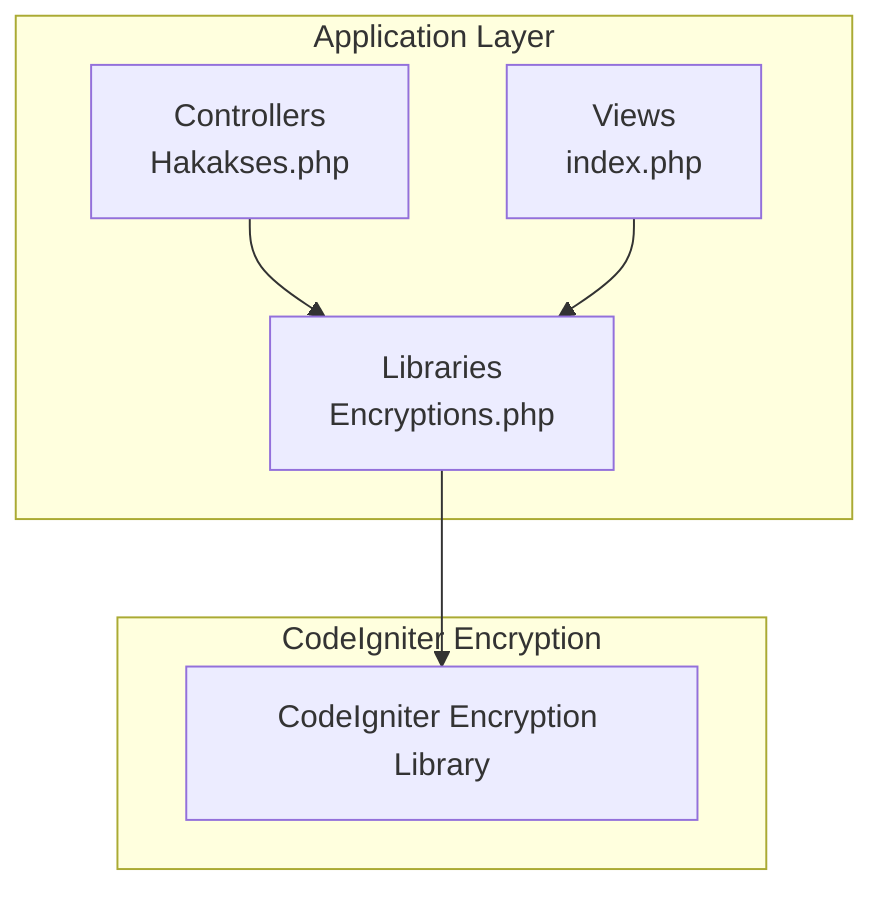
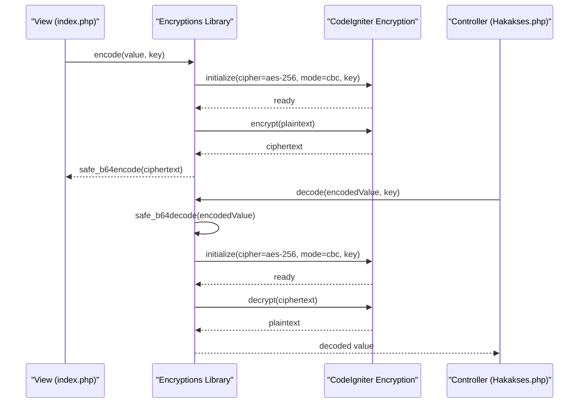
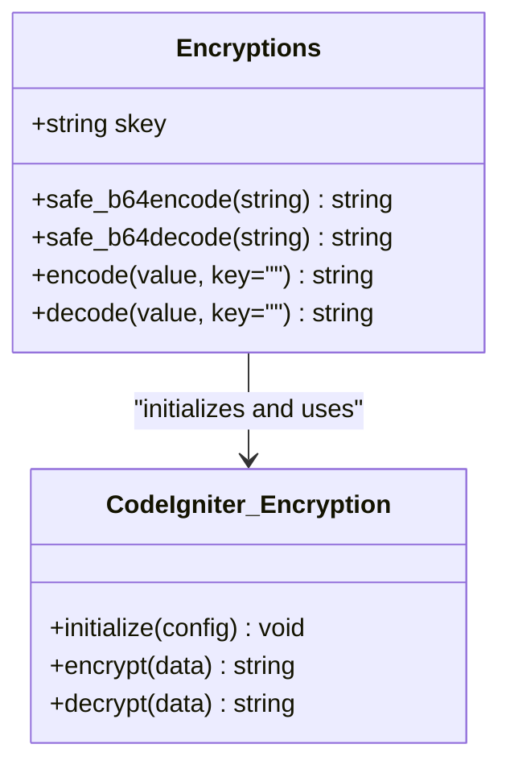
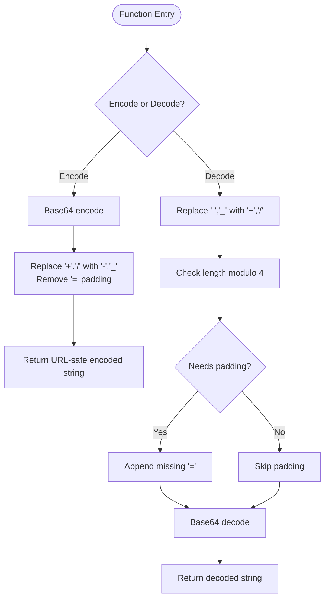
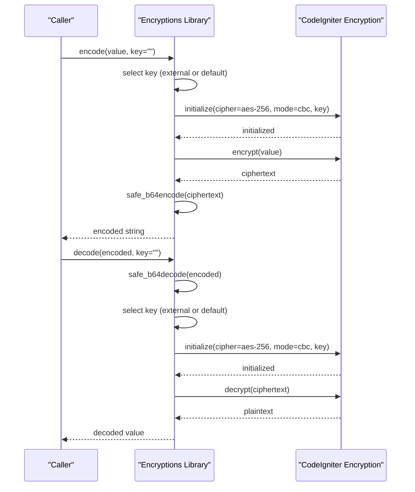
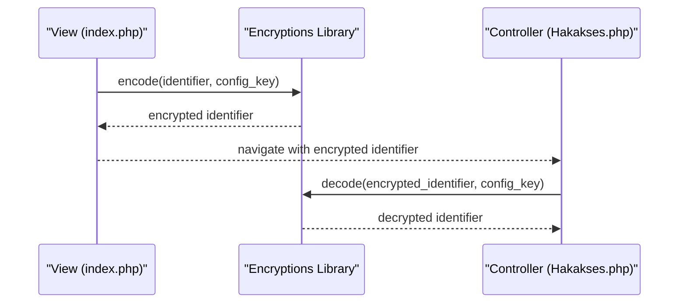
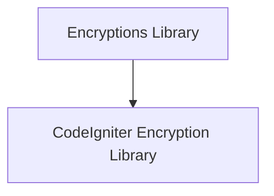

# Encryption Library

<cite>
**Referenced Files in This Document**
- [Encryptions.php](file://src/application/libraries/Encryptions.php)
- [Hakakses.php](file://src/application/controllers/Hakakses.php)
- [index.php](file://src/application/views/pages/hakakses/index.php)
- [README.md](file://README.md)
</cite>

## Table of Contents
1. [Introduction](#introduction)
2. [Project Structure](#project-structure)
3. [Core Components](#core-components)
4. [Architecture Overview](#architecture-overview)
5. [Detailed Component Analysis](#detailed-component-analysis)
6. [Dependency Analysis](#dependency-analysis)
7. [Performance Considerations](#performance-considerations)
8. [Security Best Practices](#security-best-practices)
9. [Integration Examples](#integration-examples)
10. [Troubleshooting Guide](#troubleshooting-guide)
11. [Conclusion](#conclusion)

## Introduction
This document provides comprehensive documentation for the Encryptions library, which offers AES-256 encryption functionality integrated with CodeIgniter’s encryption library. It focuses on the core methods encode() and decode() for secure data encryption and decryption, safe_b64encode() and safe_b64decode() for URL-safe base64 encoding, and the configurable cipher settings. The document explains the initialization process with AES-256 in CBC mode, key management, and the default encryption key. It also includes practical examples for encrypting sensitive data, decrypting encoded strings, and integrating with CodeIgniter’s encryption library. Security best practices, key rotation strategies, and performance considerations are addressed for common use cases such as password storage, token generation, and secure data transmission.

## Project Structure
The Encryptions library resides in the application libraries directory and is used by controllers and views to handle encryption and decryption tasks. The README indicates that the library can be imported via a command, and the project uses CodeIgniter 3.x conventions.

**Diagram sources**
- [Encryptions.php:1-56](file://src/application/libraries/Encryptions.php#L1-L56)
- [Hakakses.php:40-109](file://src/application/controllers/Hakakses.php#L40-L109)
- [index.php:45-88](file://src/application/views/pages/hakakses/index.php#L45-L88)

**Section sources**
- [README.md:1-41](file://README.md#L1-L41)

## Core Components
The Encryptions library exposes four primary methods:
- safe_b64encode(string): Performs URL-safe base64 encoding by replacing characters to ensure safe transmission in URLs and query strings.
- safe_b64decode(string): Reverses URL-safe base64 decoding, restoring original binary data for decryption.
- encode(value, key=""): Encrypts a plaintext value using AES-256 in CBC mode with a provided or default key, then applies URL-safe base64 encoding.
- decode(value, key=""): Decodes a URL-safe base64-encoded ciphertext and decrypts it using AES-256 in CBC mode with a provided or default key.

Cipher settings:
- Cipher: AES-256
- Mode: CBC
- Key: Provided externally or defaulted to an internal key

Key management:
- The library accepts an external key parameter. If none is provided, it falls back to an internal default key stored in the class.

Practical usage patterns:
- Controllers use decode() to safely retrieve and decrypt values from URLs.
- Views use encode() to produce encrypted identifiers for safe links.
- The system integrates with CodeIgniter’s built-in encryption library for cryptographic operations.

**Section sources**
- [Encryptions.php:1-56](file://src/application/libraries/Encryptions.php#L1-L56)

## Architecture Overview
The library acts as a thin wrapper around CodeIgniter’s encryption library. It initializes the encryption driver with AES-256 and CBC mode, performs encryption/decryption, and applies URL-safe base64 encoding/decoding to ensure compatibility with web contexts.

**Diagram sources**
- [Encryptions.php:21-53](file://src/application/libraries/Encryptions.php#L21-L53)
- [index.php:50-51](file://src/application/views/pages/hakakses/index.php#L50-L51)
- [Hakakses.php:45-46](file://src/application/controllers/Hakakses.php#L45-L46)

## Detailed Component Analysis

### Encryptions Library Class
The Encryptions class encapsulates encryption and URL-safe base64 encoding/decoding. It initializes the CodeIgniter encryption library with AES-256 and CBC mode and manages key usage.

**Diagram sources**
- [Encryptions.php:2-53](file://src/application/libraries/Encryptions.php#L2-L53)

**Section sources**
- [Encryptions.php:1-56](file://src/application/libraries/Encryptions.php#L1-L56)

### Base64 Encoding and Decoding
The safe_b64encode() and safe_b64decode() methods adapt base64 output for URL-safe transport by replacing URL-unfriendly characters with URL-friendly alternatives and handling padding adjustments during decoding.

**Diagram sources**
- [Encryptions.php:5-19](file://src/application/libraries/Encryptions.php#L5-L19)

**Section sources**
- [Encryptions.php:5-19](file://src/application/libraries/Encryptions.php#L5-L19)

### Encryption and Decryption Workflow
The encode() and decode() methods orchestrate the full lifecycle: key selection, encryption library initialization, encryption/decryption, and URL-safe encoding/decoding.

**Diagram sources**
- [Encryptions.php:21-53](file://src/application/libraries/Encryptions.php#L21-L53)

**Section sources**
- [Encryptions.php:21-53](file://src/application/libraries/Encryptions.php#L21-L53)

### Integration with CodeIgniter Controllers and Views
Controllers use decode() to safely extract and decrypt values from URLs, while views use encode() to generate encrypted identifiers for navigation. This pattern ensures sensitive data remains protected in transit.

**Diagram sources**
- [index.php:50-51](file://src/application/views/pages/hakakses/index.php#L50-L51)
- [Hakakses.php:45-46](file://src/application/controllers/Hakakses.php#L45-L46)

**Section sources**
- [index.php:50-51](file://src/application/views/pages/hakakses/index.php#L50-L51)
- [Hakakses.php:45-46](file://src/application/controllers/Hakakses.php#L45-L46)

## Dependency Analysis
The Encryptions library depends on CodeIgniter’s encryption library for cryptographic operations. It does not introduce external cryptographic dependencies, relying on the framework’s built-in capabilities.

**Diagram sources**
- [Encryptions.php:21-53](file://src/application/libraries/Encryptions.php#L21-L53)

**Section sources**
- [Encryptions.php:21-53](file://src/application/libraries/Encryptions.php#L21-L53)

## Performance Considerations
- Initialization overhead: The encryption library is initialized for each encode()/decode() call. For high-throughput scenarios, consider batching operations or caching keys to minimize repeated initializations.
- Base64 transformations: URL-safe base64 encoding/decoding adds minimal overhead compared to encryption itself.
- Data size: Large payloads will proportionally increase encryption/decryption time. Consider compressing data before encryption when appropriate.
- Mode choice: CBC mode is widely supported and efficient; ensure proper random IV handling through the underlying framework.

## Security Best Practices
- Key management:
  - Use a strong, randomly generated key for production environments.
  - Store keys securely (e.g., environment variables or secure configuration stores).
  - Rotate keys periodically and maintain backward compatibility during transitions.
- Default key usage:
  - Avoid relying on the internal default key in production. Override with a secure, environment-specific key.
- Input validation:
  - Validate and sanitize inputs before encryption to prevent injection attacks.
- Secure transmission:
  - Use HTTPS to protect encrypted data in transit.
- Token generation:
  - For tokens, prefer shorter-lived tokens and refresh mechanisms.
- Password storage:
  - For passwords, use dedicated password hashing functions rather than general-purpose encryption.

## Integration Examples
- Encrypting sensitive data for URLs:
  - Use encode() in views to generate encrypted identifiers passed as URL segments.
  - Example reference: [index.php:50-51](file://src/application/views/pages/hakakses/index.php#L50-L51)
- Decrypting encoded strings in controllers:
  - Use decode() to retrieve and decrypt values from URL segments.
  - Example reference: [Hakakses.php:45-46](file://src/application/controllers/Hakakses.php#L45-L46)
- Integrating with CodeIgniter’s encryption library:
  - The library initializes the encryption driver with AES-256 and CBC mode for each operation.
  - Example reference: [Encryptions.php:25-31](file://src/application/libraries/Encryptions.php#L25-L31)

## Troubleshooting Guide
- Empty or invalid input:
  - encode() and decode() return false for empty values. Ensure inputs are non-empty before calling these methods.
  - Reference: [Encryptions.php:32-33](file://src/application/libraries/Encryptions.php#L32-L33), [Encryptions.php:48-49](file://src/application/libraries/Encryptions.php#L48-L49)
- Incorrect key:
  - Mismatched keys will cause decryption failures. Verify that the same key used for encoding is provided for decoding.
  - Reference: [Encryptions.php:24-24](file://src/application/libraries/Encryptions.php#L24-L24), [Encryptions.php:41-41](file://src/application/libraries/Encryptions.php#L41-L41)
- URL-safe base64 issues:
  - Ensure the encoded string is URL-safe and properly padded. The library handles padding internally during decoding.
  - Reference: [Encryptions.php:13-18](file://src/application/libraries/Encryptions.php#L13-L18)
- Controller and view integration:
  - Confirm that the same key is used consistently across views (encoding) and controllers (decoding).
  - References: [index.php:50-51](file://src/application/views/pages/hakakses/index.php#L50-L51), [Hakakses.php:45-46](file://src/application/controllers/Hakakses.php#L45-L46)

**Section sources**
- [Encryptions.php:21-53](file://src/application/libraries/Encryptions.php#L21-L53)
- [index.php:50-51](file://src/application/views/pages/hakakses/index.php#L50-L51)
- [Hakakses.php:45-46](file://src/application/controllers/Hakakses.php#L45-L46)

## Conclusion
The Encryptions library provides a straightforward, URL-safe interface for AES-256 encryption and decryption using CodeIgniter’s built-in encryption library. By leveraging safe_b64encode() and safe_b64decode(), it ensures compatibility with web contexts. Proper key management, HTTPS usage, and input validation are essential for secure deployments. The library supports common use cases such as protecting identifiers in URLs, generating secure tokens, and enabling secure data transmission. For production, replace the default key with a strong, environment-specific key and implement periodic key rotation strategies.