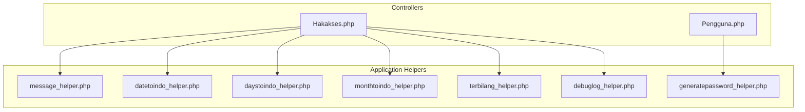
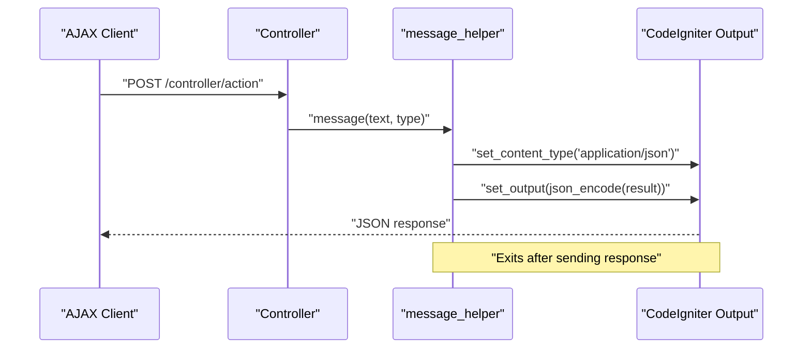
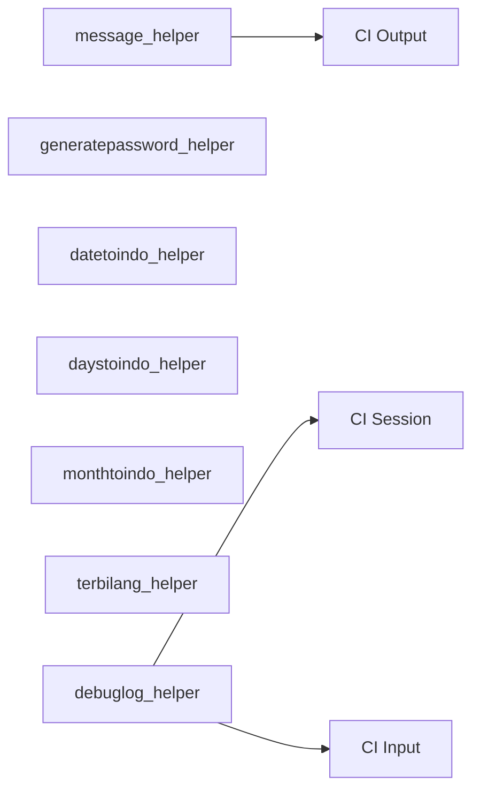

# Helper Functions

<cite>
**Referenced Files in This Document**
- [message_helper.php](file://src/application/helpers/message_helper.php)
- [generatepassword_helper.php](file://src/application/helpers/generatepassword_helper.php)
- [datetoindo_helper.php](file://src/application/helpers/datetoindo_helper.php)
- [daystoindo_helper.php](file://src/application/helpers/daystoindo_helper.php)
- [monthtoindo_helper.php](file://src/application/helpers/monthtoindo_helper.php)
- [terbilang_helper.php](file://src/application/helpers/terbilang_helper.php)
- [debuglog_helper.php](file://src/application/helpers/debuglog_helper.php)
- [Hakakses.php](file://src/application/controllers/Hakakses.php)
- [Pengguna.php](file://src/application/controllers/Pengguna.php)
</cite>

## Table of Contents
1. [Introduction](#introduction)
2. [Project Structure](#project-structure)
3. [Core Components](#core-components)
4. [Architecture Overview](#architecture-overview)
5. [Detailed Component Analysis](#detailed-component-analysis)
6. [Dependency Analysis](#dependency-analysis)
7. [Performance Considerations](#performance-considerations)
8. [Troubleshooting Guide](#troubleshooting-guide)
9. [Conclusion](#conclusion)

## Introduction
This document describes Modangci’s helper functions collection with a focus on:
- Standardized AJAX response formatting and messaging via message_helper
- Secure password generation via generatepassword_helper
- Indonesian date formatting helpers: datetoindo_helper, daystoindo_helper, monthtoindo_helper
- Number-to-text conversion in Indonesian via terbilang_helper
- Logging and debugging via debuglog_helper

It explains parameter requirements, return value formats, error handling, practical usage examples integrated with controllers and views, customization options, and best practices for performance and maintainability.

## Project Structure
The helpers are located under src/application/helpers and are autoloaded or loaded per controller as needed. Controllers demonstrate typical integration patterns for AJAX responses and data transformations.

**Diagram sources**
- [message_helper.php:1-22](file://src/application/helpers/message_helper.php#L1-L22)
- [generatepassword_helper.php:1-26](file://src/application/helpers/generatepassword_helper.php#L1-L26)
- [datetoindo_helper.php:1-23](file://src/application/helpers/datetoindo_helper.php#L1-L23)
- [daystoindo_helper.php:1-23](file://src/application/helpers/daystoindo_helper.php#L1-L23)
- [monthtoindo_helper.php:1-28](file://src/application/helpers/monthtoindo_helper.php#L1-L28)
- [terbilang_helper.php:1-107](file://src/application/helpers/terbilang_helper.php#L1-L107)
- [debuglog_helper.php:1-34](file://src/application/helpers/debuglog_helper.php#L1-L34)
- [Hakakses.php:80-109](file://src/application/controllers/Hakakses.php#L80-L109)
- [Pengguna.php:115-136](file://src/application/controllers/Pengguna.php#L115-L136)

**Section sources**
- [message_helper.php:1-22](file://src/application/helpers/message_helper.php#L1-L22)
- [generatepassword_helper.php:1-26](file://src/application/helpers/generatepassword_helper.php#L1-L26)
- [datetoindo_helper.php:1-23](file://src/application/helpers/datetoindo_helper.php#L1-L23)
- [daystoindo_helper.php:1-23](file://src/application/helpers/daystoindo_helper.php#L1-L23)
- [monthtoindo_helper.php:1-28](file://src/application/helpers/monthtoindo_helper.php#L1-L28)
- [terbilang_helper.php:1-107](file://src/application/helpers/terbilang_helper.php#L1-L107)
- [debuglog_helper.php:1-34](file://src/application/helpers/debuglog_helper.php#L1-L34)
- [Hakakses.php:80-109](file://src/application/controllers/Hakakses.php#L80-L109)
- [Pengguna.php:115-136](file://src/application/controllers/Pengguna.php#L115-L136)

## Core Components
- message_helper: Formats AJAX responses as JSON with standardized keys and renders Bootstrap-style alerts for UI feedback.
- generatepassword_helper: Generates a pseudo-random numeric password of configurable length.
- datetoindo_helper: Converts a date string into an Indonesian-formatted day-month-year string.
- daystoindo_helper: Maps numeric day-of-week to Indonesian names.
- monthtoindo_helper: Maps numeric month to Indonesian names.
- terbilang_helper: Converts numbers to Indonesian text, including decimal parts.
- debuglog_helper: Captures contextual request/response data and writes to a log file.

**Section sources**
- [message_helper.php:4-20](file://src/application/helpers/message_helper.php#L4-L20)
- [generatepassword_helper.php:4-25](file://src/application/helpers/generatepassword_helper.php#L4-L25)
- [datetoindo_helper.php:4-22](file://src/application/helpers/datetoindo_helper.php#L4-L22)
- [daystoindo_helper.php:4-22](file://src/application/helpers/daystoindo_helper.php#L4-L22)
- [monthtoindo_helper.php:4-27](file://src/application/helpers/monthtoindo_helper.php#L4-L27)
- [terbilang_helper.php:13-23](file://src/application/helpers/terbilang_helper.php#L13-L23)
- [debuglog_helper.php:4-31](file://src/application/helpers/debuglog_helper.php#L4-L31)

## Architecture Overview
The helpers are standalone PHP functions designed to be loaded by controllers or automatically by the framework. They integrate with the CodeIgniter output library for AJAX responses and with the session/input libraries for logging.

**Diagram sources**
- [message_helper.php:6-19](file://src/application/helpers/message_helper.php#L6-L19)
- [Hakakses.php:84-92](file://src/application/controllers/Hakakses.php#L84-L92)

## Detailed Component Analysis

### message_helper
Purpose:
- Standardize AJAX responses with keys for status, message, and HTML alert rendering.
- Set content type to JSON and immediately send output, then terminate execution.

Parameters:
- msg: String message text
- tipe: String status type (e.g., success/error)

Return:
- No return value; sends JSON and exits.

Behavior:
- Builds a structured result object with a Bootstrap-styled alert HTML snippet.
- Sets JSON content type and outputs encoded result.
- Terminates script execution after sending.

Usage example (from controller):
- On successful save: message("Record saved successfully", "success")
- On database error: message("Save failed: " . $error['code'] . ": " . $error['message'], "error")

Integration pattern:
- Load helper in controller action or autoload it.
- Call message() before any other output.
- Ensure IS_AJAX checks are in place when responding to AJAX requests.

Customization options:
- Modify alert class mapping for different status types.
- Change HTML template for alert rendering.
- Extend result object with additional metadata.

Error handling:
- Exits immediately after output; no fallback return value.

**Section sources**
- [message_helper.php:4-20](file://src/application/helpers/message_helper.php#L4-L20)
- [Hakakses.php:84-92](file://src/application/controllers/Hakakses.php#L84-L92)

### generatepassword_helper
Purpose:
- Generate a random numeric password of a given length.

Parameters:
- length: Integer; defaults to 6; capped at maximum possible unique digits.

Return:
- String containing unique numeric characters.

Behavior:
- Uses a character pool of digits and ensures uniqueness by avoiding duplicates.
- Caps requested length at pool size.

Usage example (from controller):
- Reset user password: load helper, call generatepassword(), hash it, update user record, then message() success.

Integration pattern:
- Load helper in controller action.
- Combine with password_hash() before persisting.

Customization options:
- Expand character pool to include letters or special characters.
- Allow repeated characters or enforce strict uniqueness.

Error handling:
- Returns a string; caller should validate length and content.

**Section sources**
- [generatepassword_helper.php:4-25](file://src/application/helpers/generatepassword_helper.php#L4-L25)
- [Pengguna.php:115-134](file://src/application/controllers/Pengguna.php#L115-L134)

### datetoindo_helper
Purpose:
- Convert a date string (YYYY-MM-DD) into an Indonesian-formatted string (DD MonthName YYYY).

Parameters:
- date: String date in YYYY-MM-DD format.

Return:
- String formatted date or false if input is "0000-00-00".

Behavior:
- Maps numeric month to Indonesian names.
- Extracts year, month, day and composes the result.

Usage example (from controller):
- Display human-readable dates in views or reports.

Customization options:
- Add support for multiple input formats.
- Localize month names for different locales.

Error handling:
- Returns false for invalid sentinel date.

**Section sources**
- [datetoindo_helper.php:4-22](file://src/application/helpers/datetoindo_helper.php#L4-L22)
- [Hakakses.php:80-109](file://src/application/controllers/Hakakses.php#L80-L109)

### daystoindo_helper
Purpose:
- Map numeric day-of-week (1–7) to Indonesian names.

Parameters:
- days: Integer day number.

Return:
- String Indonesian weekday name or false if empty.

Behavior:
- Uses a static mapping for 1=Monday through 7=Sunday.

Usage example (from controller):
- Render localized weekday labels in scheduling or reporting views.

Customization options:
- Support zero-based numbering or string inputs.
- Add pluralization or abbreviations.

Error handling:
- Returns false for empty input.

**Section sources**
- [daystoindo_helper.php:4-22](file://src/application/helpers/daystoindo_helper.php#L4-L22)
- [Hakakses.php:80-109](file://src/application/controllers/Hakakses.php#L80-L109)

### monthtoindo_helper
Purpose:
- Map numeric month (MM) to Indonesian names.

Parameters:
- month: String month in MM format.

Return:
- String Indonesian month name or false if empty.

Behavior:
- Uses a static mapping for "01" through "12".

Usage example (from controller):
- Display localized month names in calendars or reports.

Customization options:
- Accept integer input or various formats.
- Add short month names.

Error handling:
- Returns false for empty input.

**Section sources**
- [monthtoindo_helper.php:4-27](file://src/application/helpers/monthtoindo_helper.php#L4-L27)
- [Hakakses.php:80-109](file://src/application/controllers/Hakakses.php#L80-L109)

### terbilang_helper
Purpose:
- Convert numbers to Indonesian text, including decimal part.

Parameters:
- number: Numeric value (supports decimals)
- delimiter: Decimal delimiter character (e.g., ".")

Return:
- String with Indonesian text representation.

Behavior:
- Splits number into whole and fractional parts.
- Recursively converts segments (units, tens, hundreds, thousands, millions) into words.
- Handles special cases like "seratus" and "seribu".
- Converts fractional digits individually after the decimal point.

Usage example (from controller):
- Render amounts in Indonesian text for invoices or receipts.

Customization options:
- Adjust word mappings for numbers beyond supported ranges.
- Add support for negative numbers.
- Improve spacing and conjunctions.

Error handling:
- Returns undefined for unsupported ranges; caller should validate input.

**Section sources**
- [terbilang_helper.php:13-107](file://src/application/helpers/terbilang_helper.php#L13-L107)
- [Hakakses.php:80-109](file://src/application/controllers/Hakakses.php#L80-L109)

### debuglog_helper
Purpose:
- Capture contextual request/response data and write to a log file.

Parameters:
- o: Mixed data to log
- d: Optional additional data (serialized if provided)

Return:
- Void; logs to file.

Behavior:
- Captures current timestamp, logged-in user name from session, client IP address, and the provided data.
- Stores output in a buffer and writes to a file determined by commented configuration.
- Flushes and closes the file handle.

Usage example (from controller):
- Log sensitive operations or errors during development.

Customization options:
- Configure dynamic log file path and rotation.
- Switch to database-backed logging.
- Add structured JSON logging.

Error handling:
- Writes only if file variable is set; otherwise no-op.

**Section sources**
- [debuglog_helper.php:4-31](file://src/application/helpers/debuglog_helper.php#L4-L31)
- [Hakakses.php:80-109](file://src/application/controllers/Hakakses.php#L80-L109)

## Dependency Analysis
- message_helper depends on CodeIgniter’s output library for JSON encoding and on the global CI instance.
- generatepassword_helper is self-contained and depends only on PHP’s rand functions.
- Date helpers depend on string manipulation and static arrays.
- terbilang_helper depends on internal recursive helpers for number segmentation and mapping.
- debuglog_helper depends on session and input libraries and file I/O.

**Diagram sources**
- [message_helper.php:8-19](file://src/application/helpers/message_helper.php#L8-L19)
- [debuglog_helper.php:9-29](file://src/application/helpers/debuglog_helper.php#L9-L29)

**Section sources**
- [message_helper.php:8-19](file://src/application/helpers/message_helper.php#L8-L19)
- [debuglog_helper.php:9-29](file://src/application/helpers/debuglog_helper.php#L9-L29)

## Performance Considerations
- message_helper: Fast JSON encoding and immediate exit minimize overhead; avoid calling after any buffered output.
- generatepassword_helper: Unique-character loop is O(n); keep lengths reasonable to prevent long loops.
- Date helpers: Simple substring operations and array lookups; negligible cost.
- terbilang_helper: Recursive decomposition; acceptable for small to medium numbers; consider caching for repeated conversions.
- debuglog_helper: File I/O introduces latency; avoid in hot paths; rotate logs and consider asynchronous logging.

[No sources needed since this section provides general guidance]

## Troubleshooting Guide
- message_helper does not return a value; ensure no prior output is sent before calling.
- generatepassword_helper returns false-like behavior if length exceeds available unique digits; cap input appropriately.
- Date helpers return false for sentinel date; validate inputs before calling.
- terbilang_helper may return undefined for very large numbers; constrain input range.
- debuglog_helper writes only if file variable is configured; enable file path or switch to database logging.

**Section sources**
- [message_helper.php:15-19](file://src/application/helpers/message_helper.php#L15-L19)
- [generatepassword_helper.php:11-13](file://src/application/helpers/generatepassword_helper.php#L11-L13)
- [datetoindo_helper.php:19-21](file://src/application/helpers/datetoindo_helper.php#L19-L21)
- [terbilang_helper.php:75-77](file://src/application/helpers/terbilang_helper.php#L75-L77)
- [debuglog_helper.php:23-29](file://src/application/helpers/debuglog_helper.php#L23-L29)

## Conclusion
These helpers streamline common tasks: standardized AJAX responses, secure password generation, Indonesian date formatting, number-to-text conversion, and logging. Integrate them in controllers and views as demonstrated, customize where needed, and follow best practices for performance and error handling.

[No sources needed since this section summarizes without analyzing specific files]