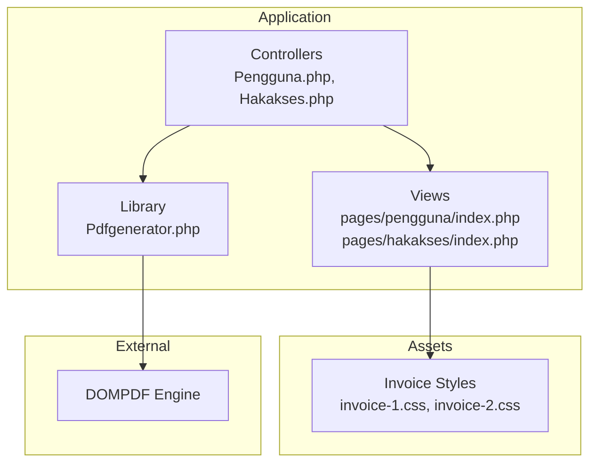
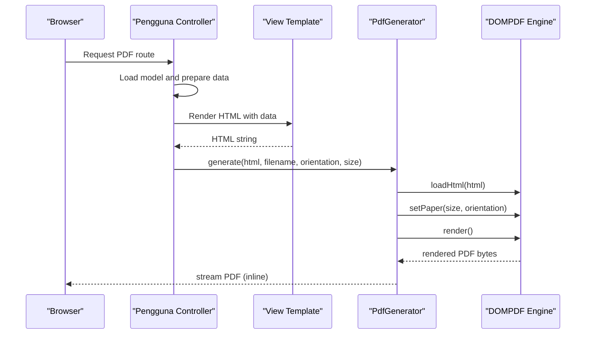
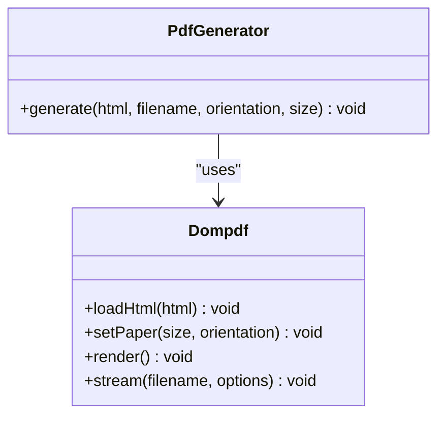
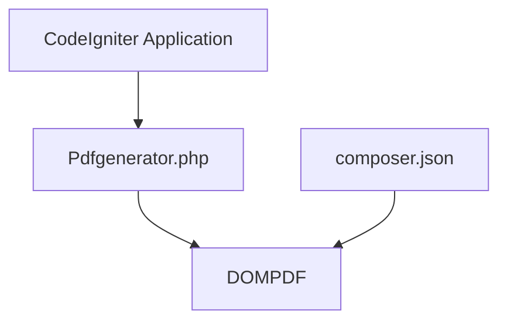

# PDF Generation Library

<cite>
**Referenced Files in This Document**
- [Pdfgenerator.php](file://src/application/libraries/Pdfgenerator.php)
- [composer.json](file://composer.json)
- [README.md](file://README.md)
- [pengguna.php](file://src/application/controllers/Pengguna.php)
- [hakakses.php](file://src/application/controllers/Hakakses.php)
- [index.php](file://src/application/views/pages/pengguna/index.php)
- [index.php](file://src/application/views/pages/hakakses/index.php)
- [invoice-1.css](file://src/public/assets/css/pages/invoices/invoice-1.css)
- [invoice-2.css](file://src/public/assets/css/pages/invoices/invoice-2.css)
</cite>

## Table of Contents
1. [Introduction](#introduction)
2. [Project Structure](#project-structure)
3. [Core Components](#core-components)
4. [Architecture Overview](#architecture-overview)
5. [Detailed Component Analysis](#detailed-component-analysis)
6. [Dependency Analysis](#dependency-analysis)
7. [Performance Considerations](#performance-considerations)
8. [Troubleshooting Guide](#troubleshooting-guide)
9. [Conclusion](#conclusion)
10. [Appendices](#appendices)

## Introduction
This document describes a lightweight PDF generation library built on top of DOMPDF for CodeIgniter applications. It covers initialization, configuration, core methods, integration patterns with controllers and models, supported HTML/CSS features, page formatting capabilities, and practical examples for generating reports, invoices, and certificates. It also includes performance considerations, memory optimization strategies, and error handling approaches.

## Project Structure
The PDF library resides in the application libraries directory and is integrated with CodeIgniter controllers and views. The repository also includes pre-built invoice templates with CSS designed for print-friendly PDF output.

**Diagram sources**
- [Pdfgenerator.php:1-17](file://src/application/libraries/Pdfgenerator.php#L1-L17)
- [pengguna.php:1-136](file://src/application/controllers/Pengguna.php#L1-L136)
- [hakakses.php:1-109](file://src/application/controllers/Hakakses.php#L1-L109)
- [index.php](file://src/application/views/pages/pengguna/index.php)
- [index.php](file://src/application/views/pages/hakakses/index.php)
- [invoice-1.css:1-200](file://src/public/assets/css/pages/invoices/invoice-1.css#L1-L200)
- [invoice-2.css:1-200](file://src/public/assets/css/pages/invoices/invoice-2.css#L1-L200)

**Section sources**
- [Pdfgenerator.php:1-17](file://src/application/libraries/Pdfgenerator.php#L1-L17)
- [composer.json:1-25](file://composer.json#L1-L25)
- [README.md:1-41](file://README.md#L1-L41)

## Core Components
- PdfGenerator library: Provides a single method to convert HTML content into a PDF stream with configurable paper size and orientation.
- DOMPDF integration: Uses the Dompdf engine to render HTML/CSS to PDF.
- Controller integration: Controllers orchestrate data retrieval, view rendering, and PDF generation.
- View templates: Provide HTML markup styled with CSS for print-ready output.

Key characteristics:
- Single public method for PDF generation.
- Fixed memory and execution limits during generation.
- Paper size and orientation configurable via parameters.
- Stream output to browser with inline display.

**Section sources**
- [Pdfgenerator.php:6-15](file://src/application/libraries/Pdfgenerator.php#L6-L15)

## Architecture Overview
The PDF generation pipeline follows a predictable flow: controllers prepare data and render views to HTML, then pass the HTML to the PdfGenerator library, which delegates to DOMPDF for rendering and streams the PDF to the browser.

**Diagram sources**
- [pengguna.php:1-136](file://src/application/controllers/Pengguna.php#L1-L136)
- [Pdfgenerator.php:6-15](file://src/application/libraries/Pdfgenerator.php#L6-L15)

## Detailed Component Analysis

### PdfGenerator Library
The library encapsulates DOMPDF usage behind a simple interface. It sets runtime limits, initializes the DOMPDF instance, loads HTML content, configures paper size and orientation, renders the PDF, and streams it to the browser.

**Diagram sources**
- [Pdfgenerator.php:3-15](file://src/application/libraries/Pdfgenerator.php#L3-L15)

Implementation highlights:
- Method signature: generate(html, filename, orientation, size='F4').
- Runtime tuning: disables max execution time and sets memory limit for generation.
- Paper configuration: accepts size and orientation parameters.
- Output mode: streams PDF inline to the browser.

Usage considerations:
- Ensure the HTML passed is complete and includes embedded styles or linked stylesheets compatible with DOMPDF.
- Choose paper sizes and orientations appropriate for the content layout.

**Section sources**
- [Pdfgenerator.php:6-15](file://src/application/libraries/Pdfgenerator.php#L6-L15)

### Controller Integration Patterns
Controllers demonstrate two common patterns:
- Data-driven report generation: fetch data from models, render a view to HTML, and pass it to the PDF generator.
- Print-friendly view templates: leverage CSS designed for print output.

Example controllers:
- Pengguna controller: manages user records and demonstrates AJAX handling alongside PDF generation.
- Hakakses controller: handles access group records and showcases form validation and CRUD operations.

Integration steps:
- Load required models and helpers.
- Prepare data arrays for the view.
- Render the view to an HTML string.
- Call PdfGenerator::generate with appropriate parameters.

**Section sources**
- [pengguna.php:1-136](file://src/application/controllers/Pengguna.php#L1-L136)
- [hakakses.php:1-109](file://src/application/controllers/Hakakses.php#L1-L109)

### View Templates and Print Styles
Prebuilt invoice templates illustrate print-friendly styling and responsive adjustments for PDF output. These templates include:
- Container layouts with padding and spacing.
- Table-based content sections.
- Footer totals and bank details.
- Print-specific CSS rules to hide UI elements and optimize layout.

Practical examples:
- Invoice 1: Full-width container with brand and items area, totals and actions.
- Invoice 2: Two-column layout for branding and items, responsive adjustments for smaller screens.

Recommendations:
- Keep HTML semantic and avoid unsupported CSS features.
- Use print media queries to remove headers, footers, and non-essential UI.
- Test with representative datasets to ensure pagination and overflow handling.

**Section sources**
- [index.php](file://src/application/views/pages/pengguna/index.php)
- [index.php](file://src/application/views/pages/hakakses/index.php)
- [invoice-1.css:1-200](file://src/public/assets/css/pages/invoices/invoice-1.css#L1-L200)
- [invoice-2.css:1-200](file://src/public/assets/css/pages/invoices/invoice-2.css#L1-L200)

### Practical Examples

#### Generating Reports
- Data preparation: Fetch aggregated metrics or lists from models.
- View rendering: Build an HTML table or chart-like structure.
- PDF generation: Pass the rendered HTML to PdfGenerator with desired paper size and orientation.

#### Generating Invoices
- Use existing invoice templates as a base.
- Populate dynamic fields (company info, customer details, line items).
- Apply print CSS to ensure clean layout and page breaks.

#### Generating Certificates
- Create a certificate template with centered text and decorative elements.
- Add dynamic recipient and event details.
- Set portrait orientation and A4 or Letter size for standard printing.

Note: The invoice templates provide a strong foundation for adapting to certificates and other formal documents.

**Section sources**
- [index.php](file://src/application/views/pages/pengguna/index.php)
- [index.php](file://src/application/views/pages/hakakses/index.php)
- [invoice-1.css:247-278](file://src/public/assets/css/pages/invoices/invoice-1.css#L247-L278)
- [invoice-2.css:201-234](file://src/public/assets/css/pages/invoices/invoice-2.css#L201-L234)

## Dependency Analysis
The library depends on the DOMPDF engine and is autoloaded via Composer. The installation guide indicates how to import the library into a CodeIgniter project.

**Diagram sources**
- [Pdfgenerator.php:3](file://src/application/libraries/Pdfgenerator.php#L3)
- [composer.json:17-25](file://composer.json#L17-L25)
- [README.md:32](file://README.md#L32)

**Section sources**
- [composer.json:17-25](file://composer.json#L17-L25)
- [README.md:32](file://README.md#L32)

## Performance Considerations
- Memory usage: The library increases the memory limit during generation to accommodate larger documents. For very large outputs, consider breaking content into pages or reducing image sizes.
- Execution time: Disabling max execution time allows long-running renders but should be used judiciously in shared hosting environments.
- Image optimization: Large images increase processing time and memory consumption. Prefer vector graphics or compressed raster images.
- CSS complexity: Simplify styles and avoid heavy JavaScript or unsupported CSS features that DOMPDF does not render.
- Pagination: For long lists, paginate content to reduce memory footprint and improve responsiveness.

[No sources needed since this section provides general guidance]

## Troubleshooting Guide
Common issues and resolutions:
- Blank or missing content: Verify that the HTML string passed to the generator includes complete DOCTYPE and styles. Ensure all assets (CSS, images) are accessible or embedded.
- Incorrect page size or orientation: Confirm the size and orientation parameters match intended output. Supported sizes depend on DOMPDF defaults.
- Browser download vs inline display: The current implementation streams inline. To trigger a download, adjust the stream options accordingly.
- Memory errors on large documents: Increase memory limit further or split content into multiple PDFs.
- Unsupported CSS: Some CSS properties are not supported by DOMPDF. Use print-friendly CSS and test incrementally.

**Section sources**
- [Pdfgenerator.php:8-14](file://src/application/libraries/Pdfgenerator.php#L8-L14)

## Conclusion
The PdfGenerator library offers a straightforward way to produce PDFs from HTML content in CodeIgniter using DOMPDF. By combining controller-driven data preparation, print-optimized view templates, and configurable paper settings, it supports a wide range of document types. For production workloads, apply the performance and troubleshooting recommendations to ensure reliable, efficient PDF generation.

[No sources needed since this section summarizes without analyzing specific files]

## Appendices

### Configuration Options Reference
- generate(html, filename, orientation, size='F4'): Generates a PDF from HTML with specified paper size and orientation, streaming inline to the browser.

Supported parameters:
- html: Complete HTML string with embedded or linked styles.
- filename: Base filename for the generated PDF.
- orientation: Page orientation ('portrait' or 'landscape').
- size: Paper size (defaults to 'F4'; other sizes depend on DOMPDF defaults).

Output behavior:
- Streams PDF inline to the browser.

**Section sources**
- [Pdfgenerator.php:6-15](file://src/application/libraries/Pdfgenerator.php#L6-L15)

### Integration Patterns
- Controller-to-library: Controllers prepare data, render views to HTML, and call PdfGenerator::generate.
- View-to-print CSS: Use print media queries to hide UI elements and optimize layout for PDF output.
- File output vs browser download: Current implementation streams inline; adjust stream options to force download when needed.

**Section sources**
- [pengguna.php:1-136](file://src/application/controllers/Pengguna.php#L1-L136)
- [hakakses.php:1-109](file://src/application/controllers/Hakakses.php#L1-L109)
- [invoice-1.css:247-278](file://src/public/assets/css/pages/invoices/invoice-1.css#L247-L278)
- [invoice-2.css:201-234](file://src/public/assets/css/pages/invoices/invoice-2.css#L201-L234)