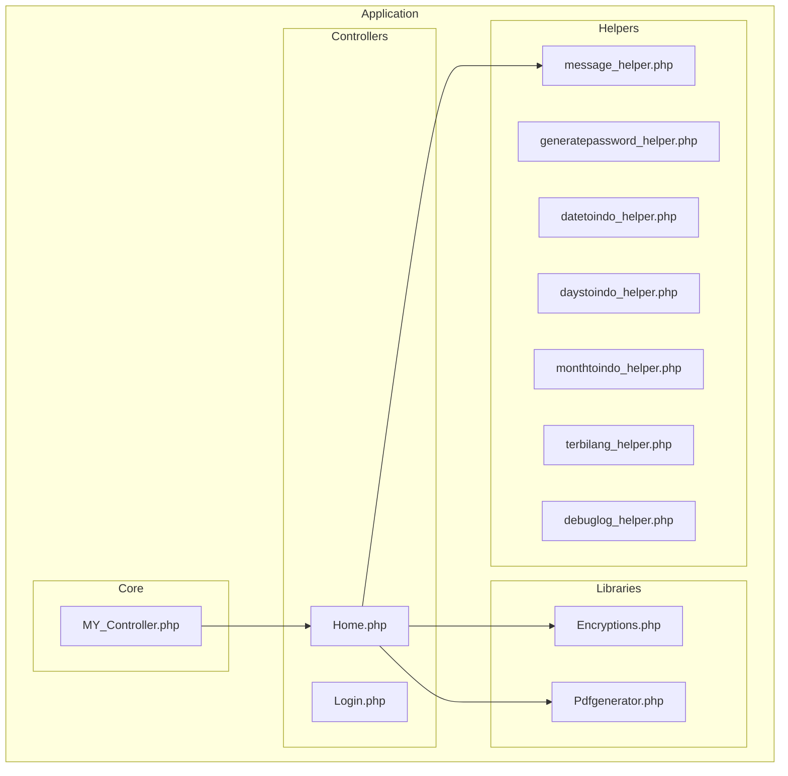
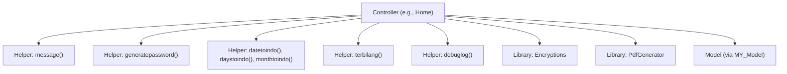
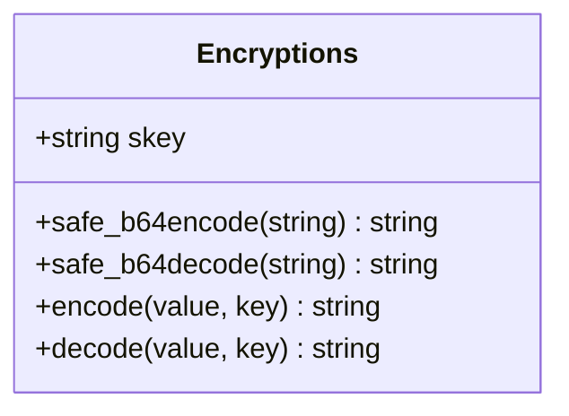
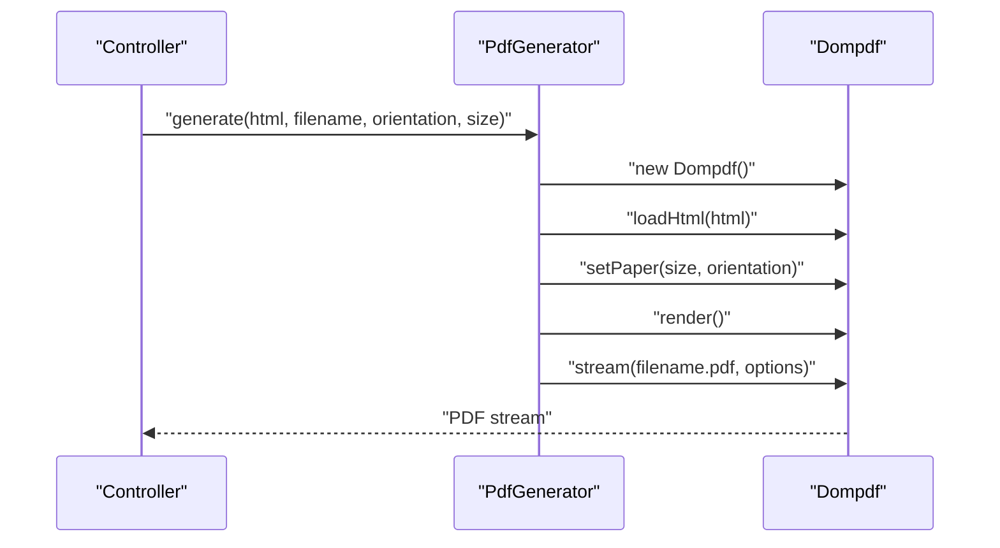
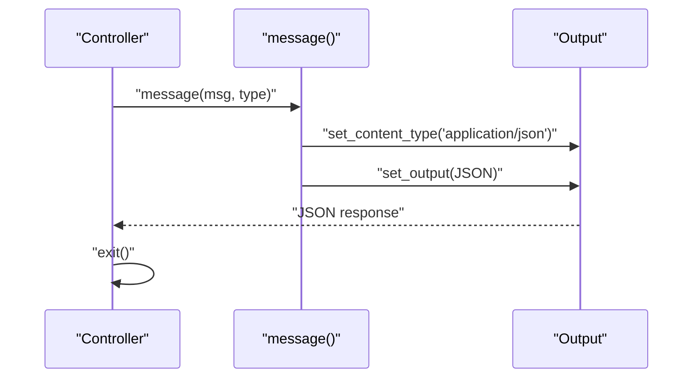
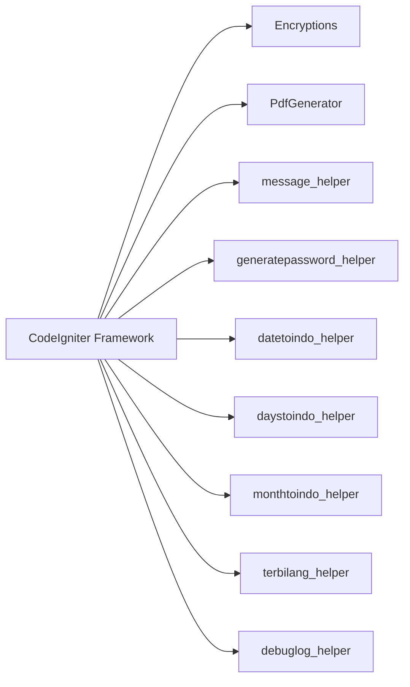

# Utility Libraries and Helpers

<cite>
**Referenced Files in This Document**
- [Encryptions.php](file://src/application/libraries/Encryptions.php)
- [Pdfgenerator.php](file://src/application/libraries/Pdfgenerator.php)
- [message_helper.php](file://src/application/helpers/message_helper.php)
- [generatepassword_helper.php](file://src/application/helpers/generatepassword_helper.php)
- [datetoindo_helper.php](file://src/application/helpers/datetoindo_helper.php)
- [daystoindo_helper.php](file://src/application/helpers/daystoindo_helper.php)
- [monthtoindo_helper.php](file://src/application/helpers/monthtoindo_helper.php)
- [terbilang_helper.php](file://src/application/helpers/terbilang_helper.php)
- [debuglog_helper.php](file://src/application/helpers/debuglog_helper.php)
- [MY_Controller.php](file://src/application/core/MY_Controller.php)
- [Home.php](file://src/application/controllers/Home.php)
- [composer.json](file://composer.json)
- [Modangci.php](file://src/Modangci.php)
- [Make.php](file://src/commands/Make.php)
</cite>

## Table of Contents
1. [Introduction](#introduction)
2. [Project Structure](#project-structure)
3. [Core Components](#core-components)
4. [Architecture Overview](#architecture-overview)
5. [Detailed Component Analysis](#detailed-component-analysis)
6. [Dependency Analysis](#dependency-analysis)
7. [Performance Considerations](#performance-considerations)
8. [Troubleshooting Guide](#troubleshooting-guide)
9. [Conclusion](#conclusion)
10. [Appendices](#appendices)

## Introduction
This document explains Modangci’s built-in utility libraries and helper functions, focusing on:
- Encryption library with AES-256 encryption, URL-safe encoding, and key management
- Helper functions for AJAX messaging, password generation, Indonesian date formatting, and number-to-text conversion
- PDF generation library integrating DOMPDF for document creation and rendering
- Practical usage patterns with controllers and models
- Security considerations, performance implications, and best practices

## Project Structure
Utilities are organized under application/libraries and application/helpers. Libraries are CodeIgniter-compatible classes loaded via the framework. Helpers are PHP function libraries registered automatically by CodeIgniter when loaded.

**Diagram sources**
- [Encryptions.php:1-56](file://src/application/libraries/Encryptions.php#L1-L56)
- [Pdfgenerator.php:1-17](file://src/application/libraries/Pdfgenerator.php#L1-L17)
- [message_helper.php:1-22](file://src/application/helpers/message_helper.php#L1-L22)
- [generatepassword_helper.php:1-26](file://src/application/helpers/generatepassword_helper.php#L1-L26)
- [datetoindo_helper.php:1-23](file://src/application/helpers/datetoindo_helper.php#L1-L23)
- [daystoindo_helper.php:1-23](file://src/application/helpers/daystoindo_helper.php#L1-L23)
- [monthtoindo_helper.php:1-28](file://src/application/helpers/monthtoindo_helper.php#L1-L28)
- [terbilang_helper.php:1-107](file://src/application/helpers/terbilang_helper.php#L1-L107)
- [debuglog_helper.php:1-34](file://src/application/helpers/debuglog_helper.php#L1-L34)
- [MY_Controller.php:1-59](file://src/application/core/MY_Controller.php#L1-L59)
- [Home.php:1-121](file://src/application/controllers/Home.php#L1-L121)

**Section sources**
- [Encryptions.php:1-56](file://src/application/libraries/Encryptions.php#L1-L56)
- [Pdfgenerator.php:1-17](file://src/application/libraries/Pdfgenerator.php#L1-L17)
- [message_helper.php:1-22](file://src/application/helpers/message_helper.php#L1-L22)
- [generatepassword_helper.php:1-26](file://src/application/helpers/generatepassword_helper.php#L1-L26)
- [datetoindo_helper.php:1-23](file://src/application/helpers/datetoindo_helper.php#L1-L23)
- [daystoindo_helper.php:1-23](file://src/application/helpers/daystoindo_helper.php#L1-L23)
- [monthtoindo_helper.php:1-28](file://src/application/helpers/monthtoindo_helper.php#L1-L28)
- [terbilang_helper.php:1-107](file://src/application/helpers/terbilang_helper.php#L1-L107)
- [debuglog_helper.php:1-34](file://src/application/helpers/debuglog_helper.php#L1-L34)
- [MY_Controller.php:1-59](file://src/application/core/MY_Controller.php#L1-L59)
- [Home.php:1-121](file://src/application/controllers/Home.php#L1-L121)

## Core Components
- Encryption Library (AES-256, CBC mode, URL-safe base64)
- PDF Generator (DOMPDF wrapper)
- Message Helper (AJAX JSON responses)
- Password Generator (numeric)
- Date/Time Helpers (Indonesian locale)
- Number-to-Text Converter (terbilang)
- Debug Logger

Integration pattern:
- Controllers load helpers and libraries as needed
- Libraries are instantiated via CodeIgniter’s get_instance() and framework loaders
- Helpers are autoloaded by CodeIgniter when loaded in controllers

**Section sources**
- [Encryptions.php:1-56](file://src/application/libraries/Encryptions.php#L1-L56)
- [Pdfgenerator.php:1-17](file://src/application/libraries/Pdfgenerator.php#L1-L17)
- [message_helper.php:1-22](file://src/application/helpers/message_helper.php#L1-L22)
- [generatepassword_helper.php:1-26](file://src/application/helpers/generatepassword_helper.php#L1-L26)
- [datetoindo_helper.php:1-23](file://src/application/helpers/datetoindo_helper.php#L1-L23)
- [daystoindo_helper.php:1-23](file://src/application/helpers/daystoindo_helper.php#L1-L23)
- [monthtoindo_helper.php:1-28](file://src/application/helpers/monthtoindo_helper.php#L1-L28)
- [terbilang_helper.php:1-107](file://src/application/helpers/terbilang_helper.php#L1-L107)
- [debuglog_helper.php:1-34](file://src/application/helpers/debuglog_helper.php#L1-L34)

## Architecture Overview
The utilities integrate with the MVC architecture as follows:
- Controllers orchestrate business logic and call helpers/libraries
- Libraries encapsulate cross-cutting concerns (security, PDF generation)
- Helpers provide reusable functions for presentation/formatting and AJAX responses

**Diagram sources**
- [Home.php:1-121](file://src/application/controllers/Home.php#L1-L121)
- [MY_Controller.php:1-59](file://src/application/core/MY_Controller.php#L1-L59)
- [message_helper.php:1-22](file://src/application/helpers/message_helper.php#L1-L22)
- [generatepassword_helper.php:1-26](file://src/application/helpers/generatepassword_helper.php#L1-L26)
- [datetoindo_helper.php:1-23](file://src/application/helpers/datetoindo_helper.php#L1-L23)
- [daystoindo_helper.php:1-23](file://src/application/helpers/daystoindo_helper.php#L1-L23)
- [monthtoindo_helper.php:1-28](file://src/application/helpers/monthtoindo_helper.php#L1-L28)
- [terbilang_helper.php:1-107](file://src/application/helpers/terbilang_helper.php#L1-L107)
- [debuglog_helper.php:1-34](file://src/application/helpers/debuglog_helper.php#L1-L34)
- [Encryptions.php:1-56](file://src/application/libraries/Encryptions.php#L1-L56)
- [Pdfgenerator.php:1-17](file://src/application/libraries/Pdfgenerator.php#L1-L17)

## Detailed Component Analysis

### Encryption Library (AES-256, CBC, URL-safe Base64)
Purpose:
- Encrypt and decrypt arbitrary text using AES-256 in CBC mode
- Encode/decode using URL-safe base64 variant

Key capabilities:
- Safe base64 encode/decode with URL-safe character substitution
- Dynamic key support with default fallback
- Initialization of CodeIgniter encryption driver per operation

Usage pattern:
- Load the library in a controller or model
- Call encode(value, key?) and decode(value, key?)
- Keys are managed externally; default key is provided for convenience

Security considerations:
- The default key is embedded in the library; replace with a strong, environment-managed key
- Ensure keys are stored securely and rotated periodically
- Avoid logging encrypted or decrypted values

**Diagram sources**
- [Encryptions.php:1-56](file://src/application/libraries/Encryptions.php#L1-L56)

**Section sources**
- [Encryptions.php:1-56](file://src/application/libraries/Encryptions.php#L1-L56)

### PDF Generation Library (DOMPDF Integration)
Purpose:
- Generate PDFs from HTML content with configurable paper size and orientation
- Stream PDFs directly to the browser

Key capabilities:
- Configure paper size and orientation
- Set execution time and memory limits for rendering
- Stream PDF with filename and disposition

Usage pattern:
- Prepare HTML content
- Instantiate PdfGenerator and call generate(html, filename, orientation, size)
- Ensure DOMPDF is installed and autoloaded

**Diagram sources**
- [Pdfgenerator.php:1-17](file://src/application/libraries/Pdfgenerator.php#L1-L17)

**Section sources**
- [Pdfgenerator.php:1-17](file://src/application/libraries/Pdfgenerator.php#L1-L17)

### Message Helper (AJAX Response Formatting)
Purpose:
- Standardize AJAX responses as JSON with status, message, and rendered HTML alert
- Automatically sets content type and exits after output

Usage pattern:
- Call message(message, status) from controllers after validation or actions
- Typical statuses: success, error

**Diagram sources**
- [message_helper.php:1-22](file://src/application/helpers/message_helper.php#L1-L22)

**Section sources**
- [message_helper.php:1-22](file://src/application/helpers/message_helper.php#L1-L22)
- [Home.php:58-96](file://src/application/controllers/Home.php#L58-L96)

### Password Generator Helper
Purpose:
- Generate numeric-only passwords of specified length
- Ensures uniqueness of digits in generated password

Usage pattern:
- Call generatepassword(length) to produce a random numeric password
- Useful for initial user passwords or temporary credentials

**Section sources**
- [generatepassword_helper.php:1-26](file://src/application/helpers/generatepassword_helper.php#L1-L26)

### Indonesian Date/Time Helpers
Purpose:
- Convert dates, days, and months to Indonesian locale equivalents

Capabilities:
- datetoindo(date): formats YYYY-MM-DD to DD NamaBulan YYYY
- daystoindo(days): maps numeric day to Indonesian weekday
- monthtoindo(month): maps MM to Indonesian month name

Usage pattern:
- Use in views or controllers to present localized dates

**Section sources**
- [datetoindo_helper.php:1-23](file://src/application/helpers/datetoindo_helper.php#L1-L23)
- [daystoindo_helper.php:1-23](file://src/application/helpers/daystoindo_helper.php#L1-L23)
- [monthtoindo_helper.php:1-28](file://src/application/helpers/monthtoindo_helper.php#L1-L28)

### Number-to-Text Converter (Terbilang)
Purpose:
- Convert numeric values to Indonesian text representation
- Handles integer part and decimal part (with configurable delimiter)

Usage pattern:
- Call terbilang(number, delimiter) to get Indonesian text
- Useful for financial documents and official forms

**Section sources**
- [terbilang_helper.php:1-107](file://src/application/helpers/terbilang_helper.php#L1-L107)

### Debug Log Helper
Purpose:
- Write structured logs for requests/responses to a file
- Captures timestamp, user info, IP, and payload

Usage pattern:
- Call debuglog(object, data?) to capture current request context
- Customize file path for persistent logs

**Section sources**
- [debuglog_helper.php:1-34](file://src/application/helpers/debuglog_helper.php#L1-L34)

## Dependency Analysis
- Libraries depend on CodeIgniter’s encryption and loader subsystems
- PDF library depends on DOMPDF; ensure Composer autoloading is configured
- Helpers are framework-driven and rely on CodeIgniter’s output and input classes
- Controllers depend on helpers and libraries for standardized behavior

**Diagram sources**
- [Encryptions.php:1-56](file://src/application/libraries/Encryptions.php#L1-L56)
- [Pdfgenerator.php:1-17](file://src/application/libraries/Pdfgenerator.php#L1-L17)
- [message_helper.php:1-22](file://src/application/helpers/message_helper.php#L1-L22)
- [generatepassword_helper.php:1-26](file://src/application/helpers/generatepassword_helper.php#L1-L26)
- [datetoindo_helper.php:1-23](file://src/application/helpers/datetoindo_helper.php#L1-L23)
- [daystoindo_helper.php:1-23](file://src/application/helpers/daystoindo_helper.php#L1-L23)
- [monthtoindo_helper.php:1-28](file://src/application/helpers/monthtoindo_helper.php#L1-L28)
- [terbilang_helper.php:1-107](file://src/application/helpers/terbilang_helper.php#L1-L107)
- [debuglog_helper.php:1-34](file://src/application/helpers/debuglog_helper.php#L1-L34)

**Section sources**
- [composer.json:1-25](file://composer.json#L1-L25)
- [Modangci.php:1-60](file://src/Modangci.php#L1-L60)

## Performance Considerations
- Encryption:
  - Initialization overhead occurs per encode/decode call; cache or reuse keys where appropriate
  - Avoid encrypting large payloads frequently; consider streaming or chunking
- PDF generation:
  - Rendering large HTML documents can be memory-intensive; adjust memory limit and execution time accordingly
  - Optimize HTML/CSS to reduce rendering cost
  - Consider server-side caching for repeated PDFs
- Helpers:
  - Message helper performs JSON encoding and immediate exit; ensure minimal pre-processing
  - Date/time helpers are lightweight; avoid repeated conversions by caching results

[No sources needed since this section provides general guidance]

## Troubleshooting Guide
Common issues and resolutions:
- Encryption failures:
  - Verify encryption driver availability and cipher/mode configuration
  - Ensure keys are correctly supplied and URL-safe encoded strings are passed to decode
- PDF generation errors:
  - Confirm DOMPDF installation and Composer autoload
  - Reduce HTML complexity or split content into smaller chunks
- Message helper:
  - Ensure no prior output before calling message; subsequent output will corrupt JSON
- Password generator:
  - Length exceeding available unique digits clamps to maximum; adjust expectations
- Date/time helpers:
  - Validate input formats; helpers expect specific patterns (YYYY-MM-DD, numeric day/month)

**Section sources**
- [Encryptions.php:1-56](file://src/application/libraries/Encryptions.php#L1-L56)
- [Pdfgenerator.php:1-17](file://src/application/libraries/Pdfgenerator.php#L1-L17)
- [message_helper.php:1-22](file://src/application/helpers/message_helper.php#L1-L22)
- [generatepassword_helper.php:1-26](file://src/application/helpers/generatepassword_helper.php#L1-L26)
- [datetoindo_helper.php:1-23](file://src/application/helpers/datetoindo_helper.php#L1-L23)
- [daystoindo_helper.php:1-23](file://src/application/helpers/daystoindo_helper.php#L1-L23)
- [monthtoindo_helper.php:1-28](file://src/application/helpers/monthtoindo_helper.php#L1-L28)
- [terbilang_helper.php:1-107](file://src/application/helpers/terbilang_helper.php#L1-L107)
- [debuglog_helper.php:1-34](file://src/application/helpers/debuglog_helper.php#L1-L34)

## Conclusion
Modangci’s utilities provide a cohesive toolkit for secure data handling, standardized AJAX responses, Indonesian localization, and document generation. By following the documented usage patterns, security hardening, and performance recommendations, teams can integrate these helpers reliably across controllers and models.

[No sources needed since this section summarizes without analyzing specific files]

## Appendices

### Helper Import System and Registration
- Helpers are loaded in controllers via CodeIgniter’s loader and become globally available within the request lifecycle
- To add a new helper, place it under application/helpers and load it in the controller or autoload it through configuration

**Section sources**
- [message_helper.php:1-22](file://src/application/helpers/message_helper.php#L1-L22)
- [generatepassword_helper.php:1-26](file://src/application/helpers/generatepassword_helper.php#L1-L26)
- [datetoindo_helper.php:1-23](file://src/application/helpers/datetoindo_helper.php#L1-L23)
- [daystoindo_helper.php:1-23](file://src/application/helpers/daystoindo_helper.php#L1-L23)
- [monthtoindo_helper.php:1-28](file://src/application/helpers/monthtoindo_helper.php#L1-L28)
- [terbilang_helper.php:1-107](file://src/application/helpers/terbilang_helper.php#L1-L107)
- [debuglog_helper.php:1-34](file://src/application/helpers/debuglog_helper.php#L1-L34)

### Library Registration and Extending Functionality
- Libraries are placed under application/libraries and accessed via CodeIgniter’s get_instance() and loader
- To extend functionality, subclass the library or add new methods while preserving existing APIs

**Section sources**
- [Encryptions.php:1-56](file://src/application/libraries/Encryptions.php#L1-L56)
- [Pdfgenerator.php:1-17](file://src/application/libraries/Pdfgenerator.php#L1-L17)

### CLI Tooling for Generators
- Modangci CLI scaffolds helpers and libraries with boilerplate code
- Use the CLI to generate new helpers and libraries quickly

**Section sources**
- [Modangci.php:1-60](file://src/Modangci.php#L1-L60)
- [Make.php:129-154](file://src/commands/Make.php#L129-L154)